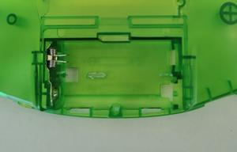
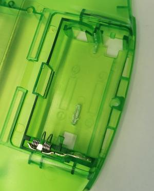

### Installation

Installing your [RetroSix CleanJuice GBA](https://handheldlegend.com/collections/game-boy-advance-gba/products/cleanjuice-game-boy-advance-li-ion-rechargeable-battery-module) is easy as can be... we've created a brief guide to make it step-by-step.

1.  Connect battery to CleanJuice GBA board (only fits in one way so don't worry).

2.  Shell trimming
    1.  RetroSix shells: No need to take any action; continue to the next step.

    2.  Regular OEM or aftermarket shells
        1.  Trim the little stump at the bottom of the battery compartment so that it's flat.

        2.  On the right-side of the battery compartment is a plastic divider that would hold each AA battery in place, between the console's terminals. Trim that plastic sticking out so that it creates a flat wall, and along the bottom to make sure the plastic divider is completely cut out. See images (below).

        3.  **Do not** trim the plastic divider sticking out from the left side of the battery compartment.

3.  **Optional:**Peel the double-sided tape in order to sturdily keep the battery in-place. In most cases it wont be needed, but is available if you choose.
    1.  **Note:** Using the double-sided tape will make it much more difficult to remove the battery if you choose to do so in the future.

4.  Place battery into shell with the wire coming out at the top left corner.

5.  Place CleanJuice GBA board in left side first, then push down the right side so that the springs of the CleanJuice GBA make contact with the GBA battery springs.
    1.  **Note:** You may need to carefully and slightly flex the board for it to fit snugly and properly.

6.  Use a [RetroSix USB-C battery cover](https://handheldlegend.com/collections/game-boy-advance-gba/products/pre-milled-game-boy-advance-battery-cover-for-cleanjuice-gba) (sold separately, in various colors), or cut a hole for the USB-C port ([3D printer .stl file](https://cdn.shopify.com/s/files/1/0689/3143/files/Clean_Juice_USB_C_Guide.stl?v=1589805195)) using a 4mm drill bit and drill 3 holes in the center of the battery cover.

7.  Double-check to make sure the battery is sitting flat in the battery compartment, and that the CleanJuice GBA board is also siting flat on top of the battery. Finally check that the springs on the right hand side are pressing against the battery terminals of the GBA with a bit of pressure.

8.  Put the back cover on the console, being sure to line up the USB-C port on the CleanJuice GBA and the port cut into the battery cover.

9.  Give the CleanJuice GBA a full charge and prep for some gaming!

### Troubleshooting

*   **Q:** The CleanJuice GBA board keeps popping up on the right side \[and doesnt touch the console's battery terminals].
    *   **A:** There can be two things causing this - the terminals are pressed in a bit and/or the shell's tolerances when made have the battery compartment slightly too wide or too narrow.
        *   **Terminals:** Gently and slowly bend the CleanJuice GBA board springs outward (towards the right) so that a better pressure and contact is created when the board is in position.

        *   **Compartment size:** Sometimes we've seen shells that need a different approach: Leaving the battery connected and in the battery compartment, set the board into the compartment on the *right* first, ensuring the contacts are touching, then lay flat the left side of the board; you may need to gently flex the board for it to have it set in place using pressure.

