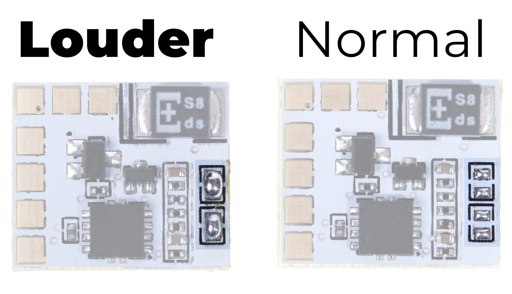

The following was written by the team at [RetroSix:](https://retrosix.co.uk/)

To begin with it's always best to test your original consoles sound works. It isn't always required, as you have have a dead speaker, but if your console works first its a good sign.&#x20;

Open up the Game Boy using a Tri-wing screwdriver by removing the 6 screws on the back (2 inside the battery compartment).

As you open up the console you will see a large ribbon cable connecting the two halves. Grab it firmly and pull it out of the white connector on the bottom half of the console.

Use double sided tape (optional) to secure the CleanAmp in position as shown.&#x20;

Take some Kynar/wrapping wire (30awg or 28awg gauge wire - the thin stuff), cut it to length and solder the wires from the points on the Game Boy to the pads on the CleanAmp as shown.

Be careful when soldering the CleanAmp pads that you do not short the pads together or remove the resistors or capacitors near the pads.

Solder the two wires on the top right of the CleanAmp to the outer 2 pads of the speaker. Polarity doesn't matter, you can solder either wire to either side. Stick the speaker in the location shown with double-sided tape or hot glue. Place it accurately where shown otherwise the top shell might hit the speaker and not close.

Finally, remove the old speaker from the front PCB by cutting or desoldering the speaker wires.

# Even louder?

If you want the audio even louder you can join these two pads together. If you don't like it, just remove the solder joins to restore it to normal.

# Troubleshooting

The wire on the far left is power in from the Game Boy. This should be 5 volts.

The wire on the bottom left is the headphone pin that should be grounded when no headphones are present and floating when headphones are inserted. If you have no audio the first check is to solder the wire to the same pad as the bottom right wire (ground). If that makes the audio work, but when its connected to the correct location it doesn't, you have a damaged headphone jack. You can leave the wire where the bottom right wire is soldered, but your speaker won't turn off if you insert headphones.

The wire that goes on the second pin up of the volume wheel is the audio input. This is the unamplified, volume controlled sound from the console.

The wire below that on the bottom of volume wheel is ground.

If you have questions regarding your install, please contact us at support\@handheldlegend.com

