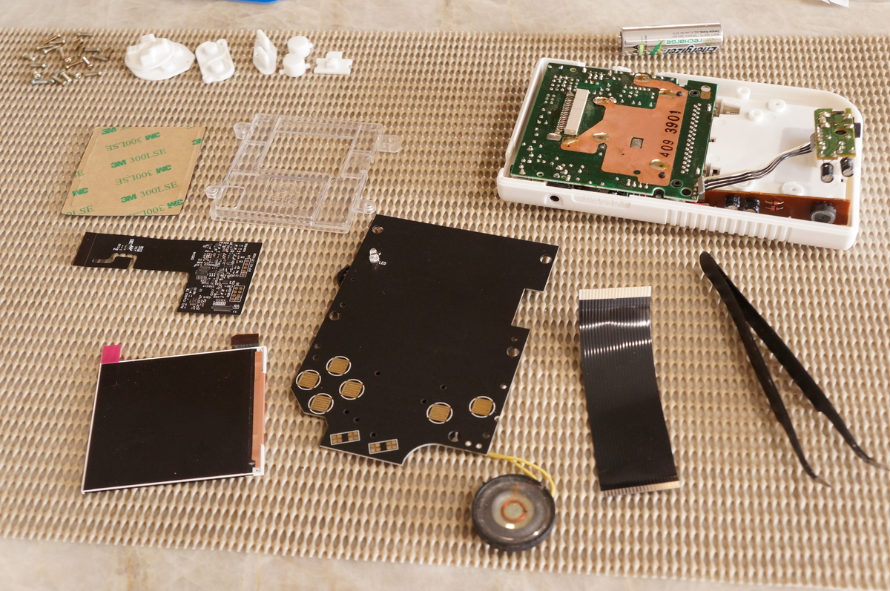
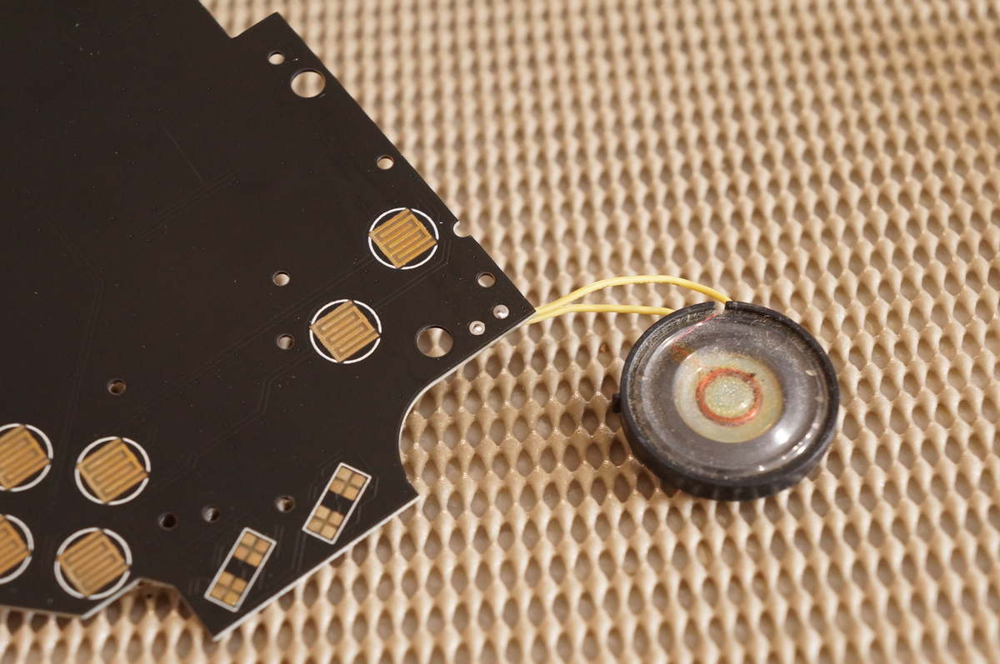
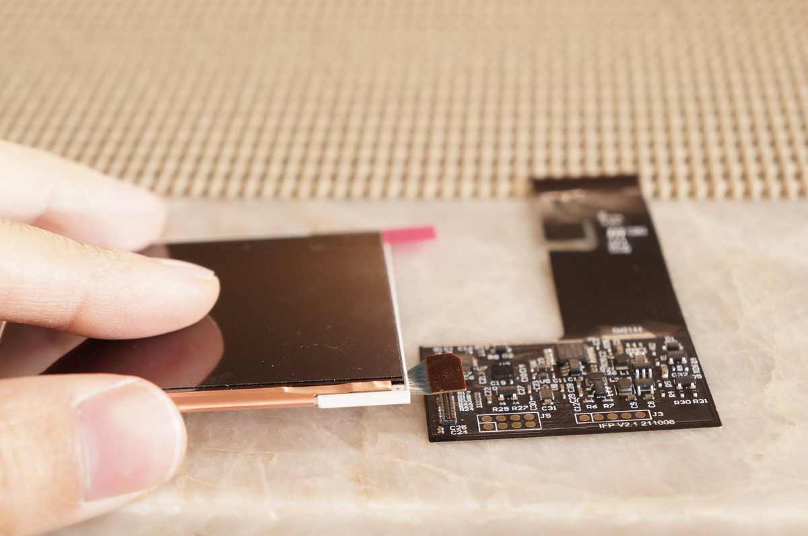
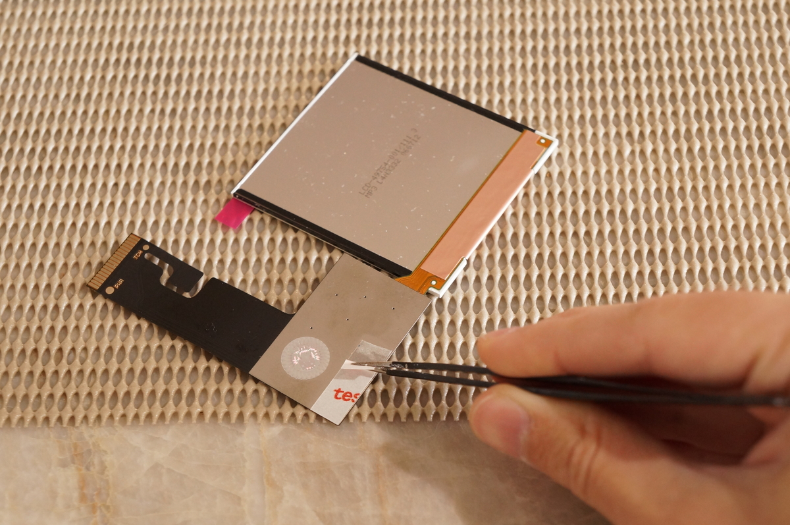
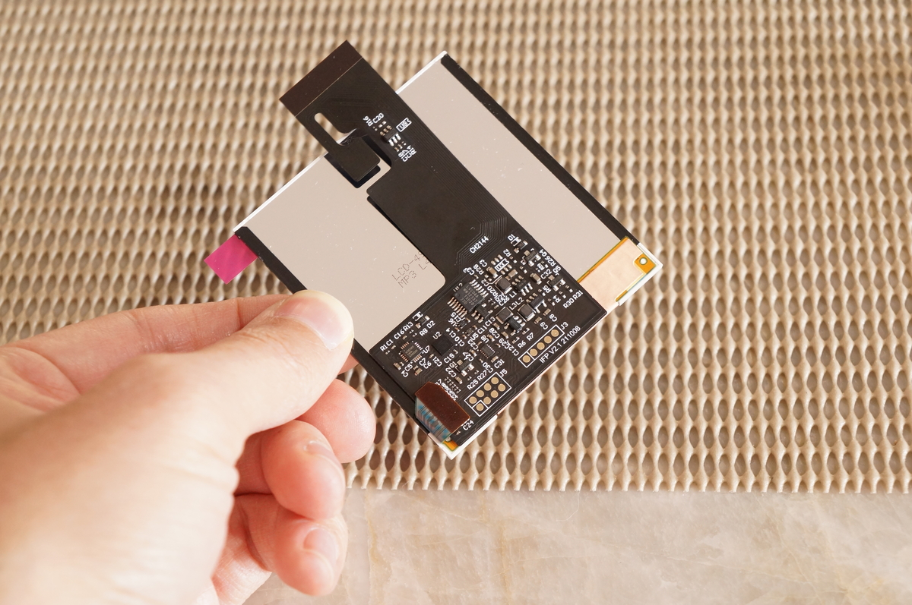
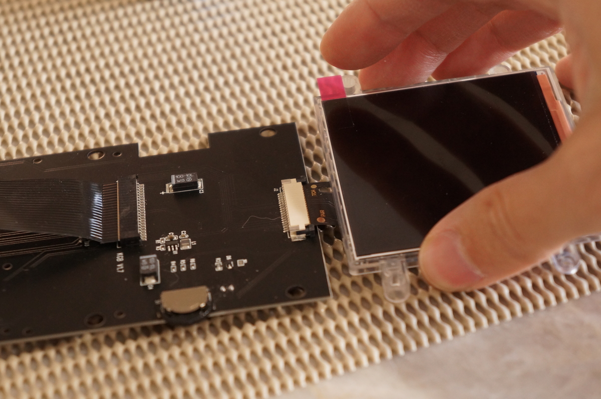
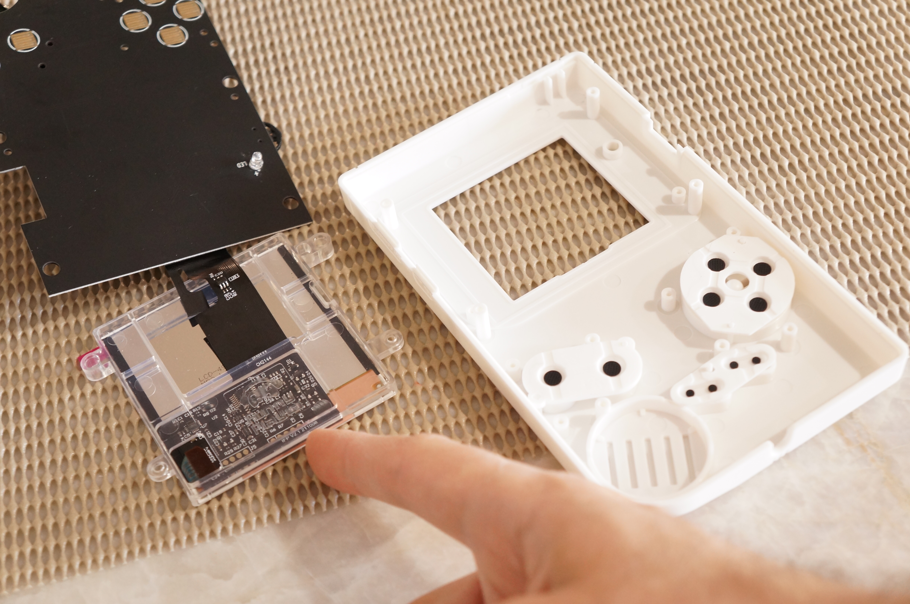
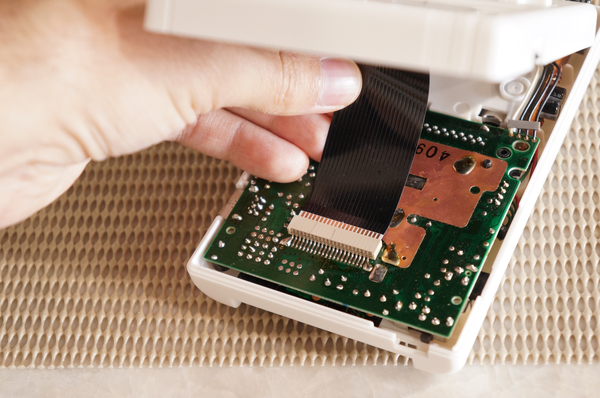
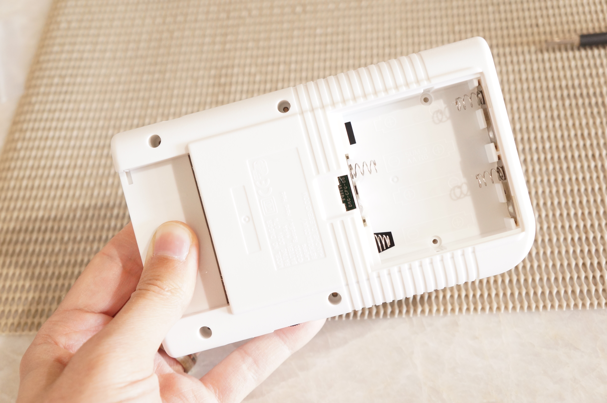
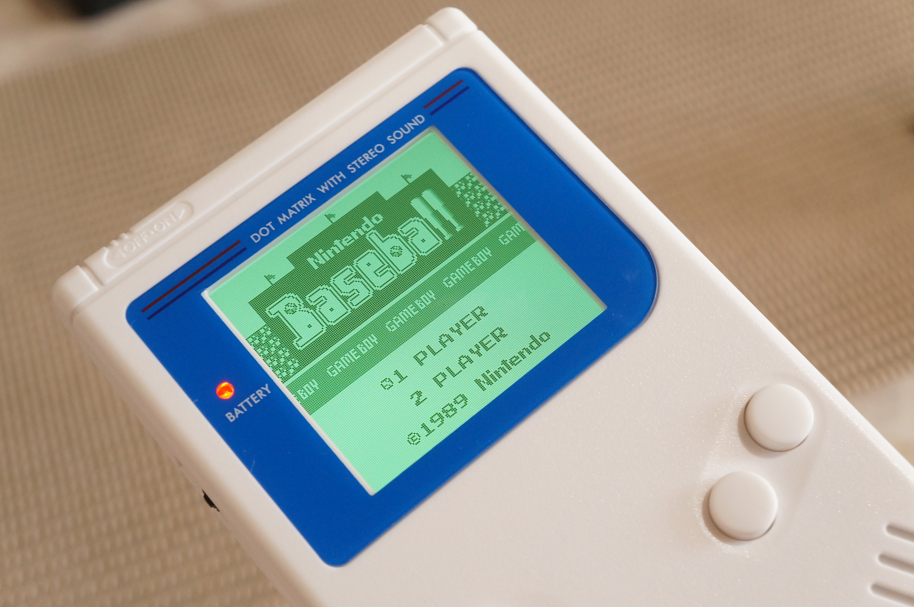

This is our install guide for the [Funnyplaying Q5 Retro Pixel IPS mod.](https://handheldlegend.com/collections/game-boy-dmg-displays/products/game-boy-dmg-retro-pixel-ips-lcd-kit-funnyplaying)

## Video Guide

<https://www.youtube.com/watch?v=DvDrBTd6rNs&t=54s>

## Getting Started

### Required Tools & Parts

*   Soldering Iron

*   Tweezers

*   PH1 screwdriver

*   Y1 Tri-point screwdriver

*   [Funnyplaying display alignment bracket](https://handheldlegend.com/collections/game-boy-dmg-displays/products/funnyplaying-retro-pixel-bracket)

*   [IPS modified DMG housing](https://handheldlegend.com/collections/game-boy-dmg/Shells)

*   [Game Boy DMG speaker](https://handheldlegend.com/collections/game-boy-dmg/Audio) (Harvesting your old one is fine!)

### Take Inventory

Ensure you have all parts included with this kit. See below.

:::hint{type="danger"}
Screen alignment bracket is **sold separately.**

****[**Purchase by following this link.**](https://handheldlegend.com/collections/game-boy-dmg-displays/products/funnyplaying-retro-pixel-bracket)****
:::

:::hint{type="info"}
**Funnyplaying Q5 Retro Pixel Kit Includes:**

*   LCD control adapter board

*   Ribbon cable for main board/LCD board

*   IPS Panel

*   IPS control flex PCB

*   Screen adhesive
:::

### Prerequisite Steps

1.  [Fully disassemble your DMG Game Boy](https://wiki.handheldlegend.com/dmg-disassembly-guide)

2.  **Leave the main board in the rear housing. Removal is unnecessary.**

3.  [Read our getting started guide on soldering](https://wiki.handheldlegend.com/soldering-iron-guide)

4.  [Fully test your IPS kit before installation](https://wiki.handheldlegend.com/ips-lcd-dry-test)

:::hint{type="warning"}
Installing your IPS kit, bending the ribbon cables, soldering, or applying any adhesives in this kit will **void the warranty and return policy.** [Fully test your kit before proceeding.](https://wiki.handheldlegend.com/ips-lcd-dry-test)
:::

## Install Guide

### Solder Speaker to IPS board

Solder your speaker to the new IPS control board as shown. The polarity of these wires does not matter.

### Set Up IPS Panel Assembly

Connect the IPS panel to the IPS control board as shown. This is easier done on a completely flat workspace.

The rear of the flex control pcb has a small strip of adhesive. Peel the adhesive backing and stick the control board to the rear of the IPS panel as shown.

Place the IPS display assembly into the alignment bracket. The longer portion of the flex PCB should stick out through the wide opening in the rear side of the alignment bracket as shown.

### IPS Control Board Adapter Assembly

Insert the larger ribbon cable into the larger FPC connector as shown. This is a *pressure fit* connector. Use a firm but gentle force to push this cable into place.

Connect the IPS assembly to the IPS control board as shown. Latch the bale on both sides to ensure a proper connection.

### Shell Modification (Optional)

Original and non-IPS ready shells: Perform steps 1 and 2.
[Prestige IPS ready shells:](https://handheldlegend.com/collections/game-boy-dmg/products/game-boy-dmg-prestige-ips-ready-shell?variant=31785169748102) Perform step 2 (enlarge the display area).
[FunnyPlaying IPS ready shell:](https://handheldlegend.com/collections/game-boy-dmg/products/funnyplaying-game-boy-dmg-ips-shell?variant=39629183484038) No modifications necessary.

### Install IPS board

Add all buttons and membranes to the front shell. Optionally, apply the screen adhesive. **We recommend *****against *****using the screen adhesive** for this particular mod as the new bracket does a wonderful job of holding the screen in position.&#x20;

Line up the holes on the alignment bracket with the screw posts on the front shell. This should be a nearly perfect fit. Take your time to ensure everything sits flush against the front of the shell. Fold the IPS board into place and ensure the speaker is fitted properly to its cutout in the shell.

Check the adjustment wheel to ensure it sits properly in the shell. Trim any plastic that may be touching the wheel.

Install the 8 PH1 screws to hold the IPS control board in place.

### Final Assembly

Connect the IPS control board assembly to the main board via the larger end of the ribbon cable.&#x20;

Replace the 6 Y1 screws on the rear housing.

### Installation complete!

Install some fresh AA batteries or a [CleanJuice battery mod](https://handheldlegend.com/collections/game-boy-dmg/Power), and you're all set!&#x20;

## Product Controls

Toggling the control wheel up/down adjusts the brightness. Press the control wheel in once to switch to color palette switch mode. Toggling the control wheel up/down will change the color displayed. Long press (five seconds) to change Pixel modes.

## Troubleshooting

*   [IPS Troubleshoot Guide.](https://wiki.handheldlegend.com/ips-troubleshooting-guide)

*   If you have any questions or concerns, please reach out to support\@handheldlegend.com

