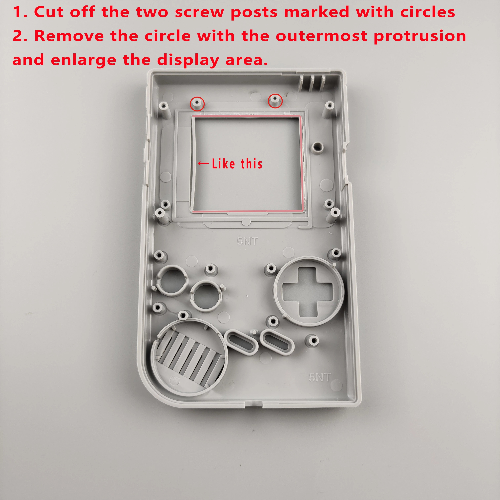

This is our install guide for the [HISPEEDIDO V5 IPS mod.](https://handheldlegend.com/collections/game-boy-dmg-displays/products/game-boy-backlight-dmg-ips)

## Video Guide

<https://www.youtube.com/watch?v=hLWlTaeuK2o>

## Getting Started

### Required Tools & Parts

*   Soldering Iron

*   Tweezers

*   PH1 screwdriver

*   Y1 Tri-point screwdrive

*   Double sided tape

*   [IPS modified DMG housing](https://handheldlegend.com/collections/game-boy-dmg/Shells)

*   [Game Boy DMG speaker](https://handheldlegend.com/collections/game-boy-dmg/Audio) (Harvesting your old one is fine!)

:::hint{type="danger"}
We recommend against using the included foam adhesive strips. We use double sided scotch tape adhesive instead as it allows easier removal if adjustments need to be made down the line. The included adhesive **will likely damage the IPS display** if you attempt removal. **Use the included adhesive at your own risk.**
:::

### Take Inventory

Ensure you have all parts incldued with this kit. See below.

:::hint{type="info"}
**Hispeedido V5 kit Includes:**

*   LCD control adapter board (Large front PCB)

*   Ribbon for main board/LCD board (Large ribbon)

*   IPS Panel (LCD)

*   IPS control PCB (pre-connected to IPS panel for convenience - this is the small PCB)

*   Small Ribbon

*   Screen adhesives

*   Alignment bracket
:::

### Before you proceed...

1.  [Fully disassemble your DMG Game Boy](https://wiki.handheldlegend.com/dmg-disassembly-guide)

2.  **Leave the main board in the rear housing. Removal is unnecessary.**

3.  [Read our getting started guide on soldering](https://wiki.handheldlegend.com/soldering-iron-guide)

4.  [Fully test your IPS kit before installation](https://wiki.handheldlegend.com/ips-lcd-dry-test)

:::hint{type="warning"}
Installing your IPS kit, bending the ribbon cables, soldering, or applying any adhesives in this kit will **void the warranty and return policy.** [Fully test your kit before proceeding.](https://wiki.handheldlegend.com/ips-lcd-dry-test)
:::

## Install Process

### Solder Speaker to IPS board

Solder your speaker to the new IPS control board as shown. The polarity of these wires does not matter.

### Set Up IPS Panel Assembly

The unbranded V5 kit IPS comes pre-connected to the IPS control PCB. If yours is not already connected, connect the IPS panel to the IPS control board. This is easier done on a completely flat workspace.

Apply a small strip of double sided tape to the rear of the IPS control PCB. Stick the control board to the rear of the IPS panel as shown.

Connect the IPS assembly to the IPS control board as shown. Ensure the cable is fully inserted and close the latch to secure it in place. For both ports, the small ribbon cable should be pins side down when inserted into each one.

Apply a small strip of double sided tape to the larger portion of the IPS alignment bracket. Peel the protective film off of the IPS display and insert the IPS panel into the bracket.

*Note*: For the small ribbon, make sure the blue tab on each end of the small ribbon is facing up in the small PCB port and the large PCB port. The large ribbon will be pin side up when inserted into the front PCB and into the motherboard.

### Shell Modification (Optional)

If you are not using a pre-cut shell, see the trimming guide below.** Englarging display area is not required for this kit, please disregard step 2.**

***Note:***** If your shell has a third tab, which is circled in the image below, please trim this from the shell:**

### Install IPS board

Add all buttons and membranes to the front shell. **Again, we recommend *****against *****using the included screen adhesive** for this particular mod as the bracket does a wonderful job of holding the screen in position.&#x20;

Line up the holes on the alignment bracket with the screw posts on the front shell. This should be a nearly perfect fit. Take your time to ensure everything sits flush against the front of the shell. Fold the IPS board into place and ensure the speaker is fitted properly to its cutout in the shell.

Check the adjustment wheel to ensure it sits properly in the shell. Trim any plastic that may be touching the wheel.

Install the 6 PH1 screws to hold the IPS control board in place.

Install the larger ribbon cable on the IPS board. This is a pressure-fit connector; some gentle force may be required to properly seat the cable.

### Final Assembly

Connect the IPS control board assembly to the main board via the larger end of the ribbon cable.

Replace the 6 Y1 screws on the rear housing.

### Installation complete!

Install some fresh AA batteries or a [CleanJuice battery mod](https://handheldlegend.com/collections/game-boy-dmg/Power), and you're all set!&#x20;

## Product Controls

Rotating the control wheel adjusts the brightness. Press the control wheel in once to switch the color palette. Long press (five seconds) to enter the on-screen display mode. From here you can control various settings relating to color and battery level display.

## Troubleshooting

*   [IPS Troubleshoot Guide.](https://wiki.handheldlegend.com/ips-troubleshooting-guide)

*   If you have any questions or concerns, please reach out to support\@handheldlegend.com

