[Before getting started, fully disassemble your GBA SP using this guide.](https://wiki.handheldlegend.com/gba-sp-disassembly-guide)

## Install Guide

We want to connect the funny playing’s ribbon cable to the connector on the back of the screen. This is super simple as it just clips in. You will notice that the lens protector is already installed which saves a lot of time and rules out the risk of dirt or dust getting caught underneath the lens. With the cable installed, bend the ribbon back like in the picture below. You can secure the ribbon cable to back of the screen with some tape if you like.

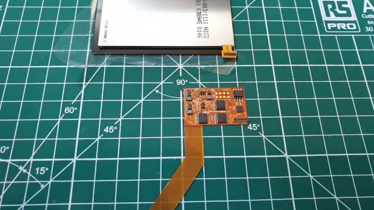

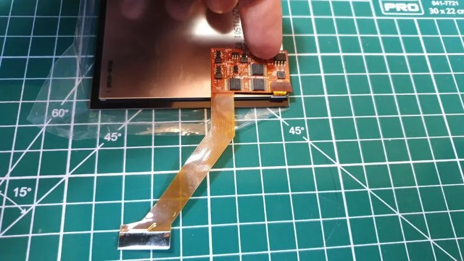

With the ribbon installed, I would recommend testing the screen before proceeding any further. Connect the ribbon cable to the motherboard port and hold the battery in place to test. As you can see, our screen fires up perfectly!

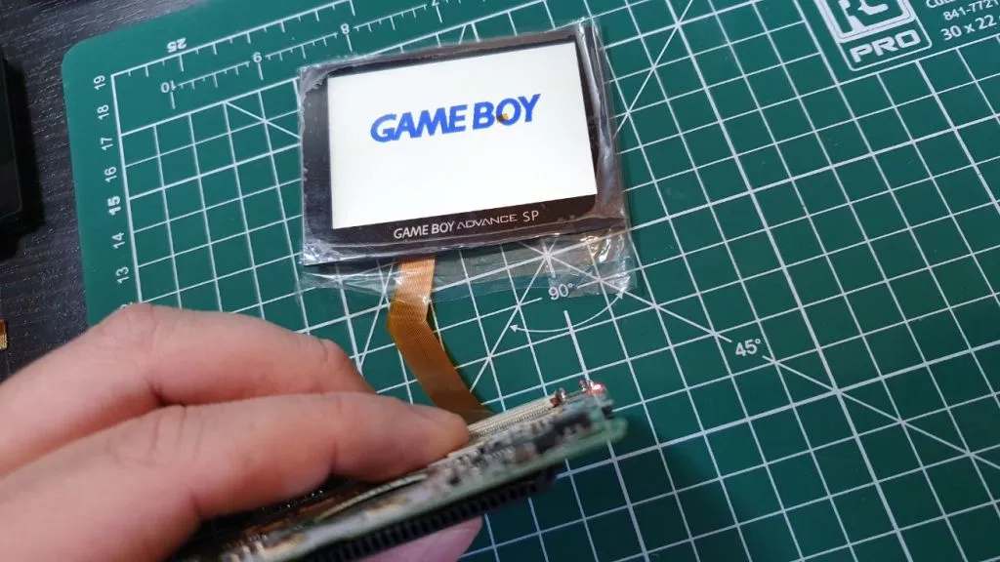

Now, to install the GBA SP IPS screen either back into the original shell or into a replacement like I am doing. The screen fits perfectly into the front half of the shell, you don’t need to add any spacer as you do in the GBA IPS mod.

**If you have purchased an IPS ready shell, there are no shell modifcations that will need to be performed. If you have a non-IPS ready or OEM shell, you will need to perform this trim to fit the IPS LCD.** **(If you have any questions about this, please reach out to support before trimming your sell). **The top half of the shell causes a little trouble, the inside of the shell needs a very small modification in order to close with the new screen and ribbon cable installed.

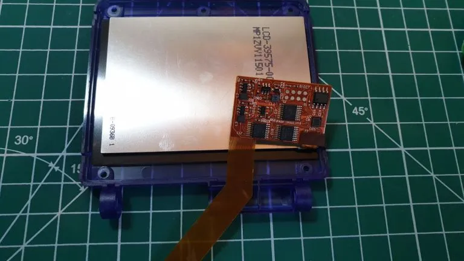

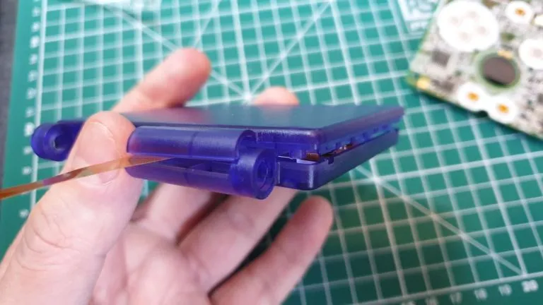

We will need to trim the inside of the shell as outlined in the below picture. This is very easy to do but might be a little time consuming if you are a perfectionist. You can use a rotary tool like a Dremel or even some flush cutters. Remove the area I have marked out and this will allow room for the shell to close.

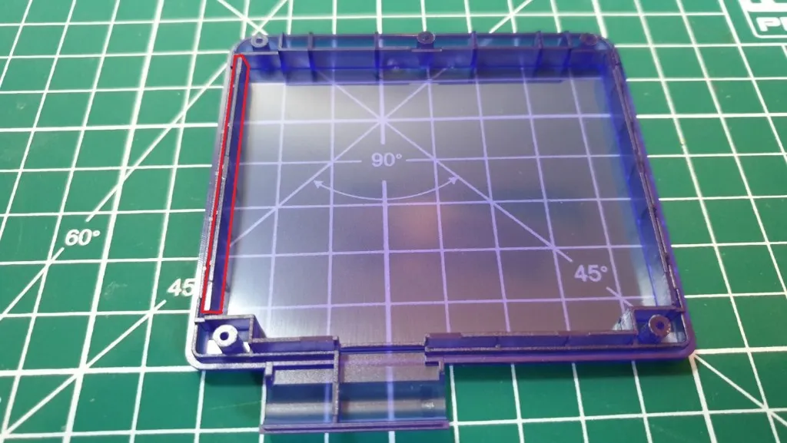

Once finished, we will be able to put the two halves together. Inside the Funny Playing box, you will remember there was a foam cut out, this cut out sits behind the screen to stop it and the ribbon cable rattling around. Remember to put it in place before closing the two halves. You will also want to bend the ribbon cable around so it doesn’t get caught in the shell.

After this, screw the two halves together with the 5 Tri-point screws we took out earlier (Replacement shells usually come with their own set).

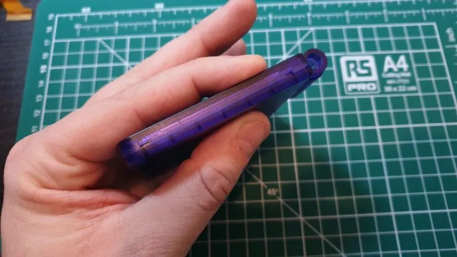

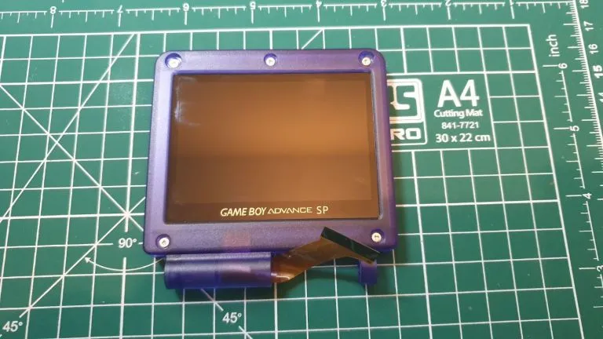

We can now attach the screen portion of the case to the bottom. Line it up into place and pass the ribbon cable through the slot. Next up, find your hinges and slide the new caps on to the. Holding the two halves of the shell together its time to reinstall the hinges. They go back in a certain way, I cover this in my GBA SP reshell guide here.

Be sure to screw the small philips head screw in to attach the hinge cover.

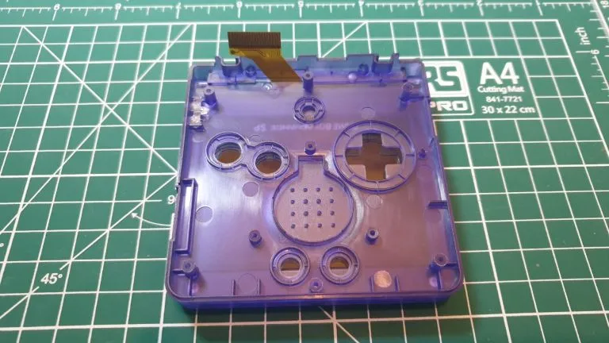

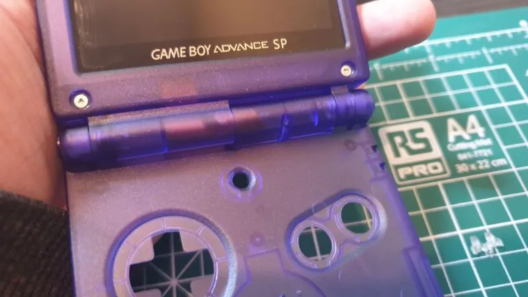

Attach the ribbon cable to the motherboard being sure to pull down on the clips each side to secure it into place. 

Now we are about to solder the included wire to allow us to control the brightness. This is optional, but I would personally recommend doing if possible. It’s quite straight forward to do.

We want to solder from point Q12B to the point on the ribbon cable. Add some flux to your points and you really only need a tiny amount of solder. You can tin your wire with a little flux and solder to make things easier and when ready just touch your hot soldering iron to the points.

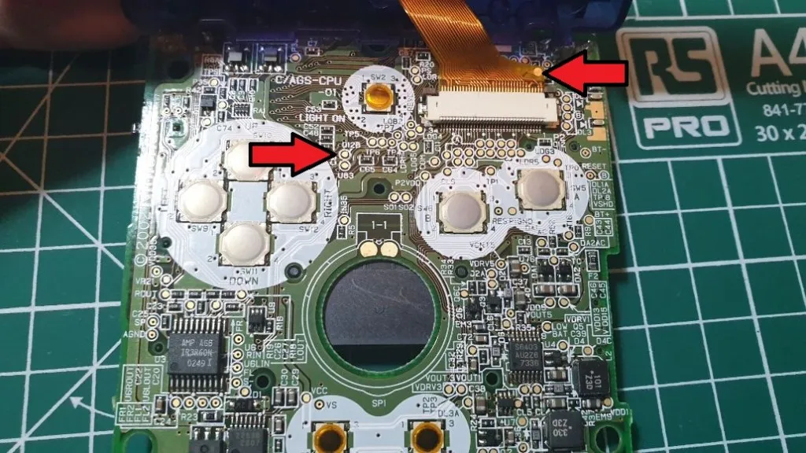

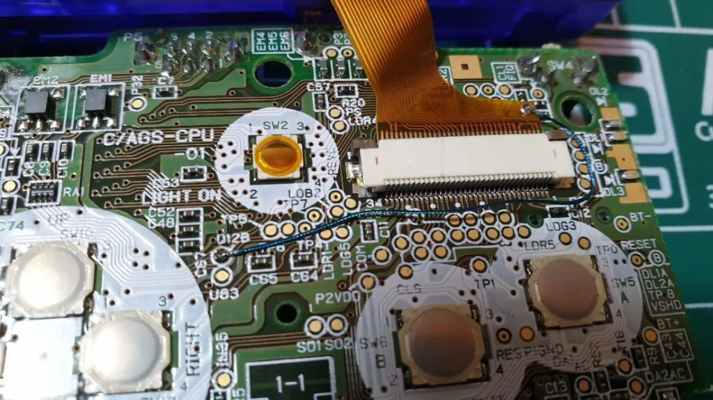

With the brightness control wired up, we will have 6 different levels of brightness! Just be sure to not dangle your wire across where any of the button pads are going to go.

We can now install all buttons, rubber pads and speakers back into place. You may need to line up the volume & power slider also. Once they are in place we can sink the motherboard back into the shell. once the board is back in the shell you can screw it down with the 3 Philips head screws from before.

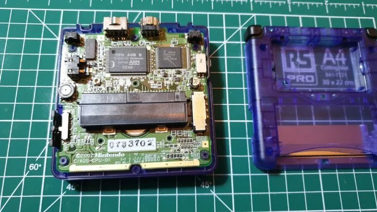

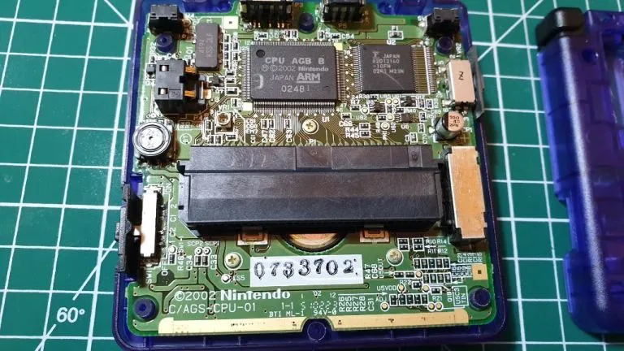

Locate the tiny square-shaped washer, This fits in the back part of the shell. Without this washer, we would not be able to screw together the battery compartment. Push it into place and we can finally put the GBA SP back together.

Install all the screws we took out and don’t forget the rubber pads around the screen bezel, they just push in.

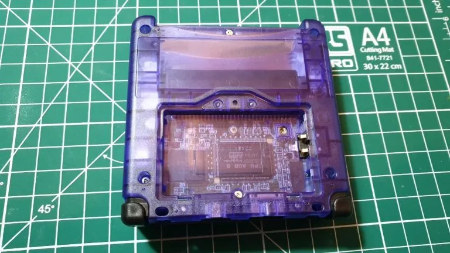

## Troubleshooting

*   [IPS Troubleshoot Guide.](https://wiki.handheldlegend.com/ips-troubleshooting-guide)

*   If you have any questions or concerns, please reach out to support\@handheldlegend.com

