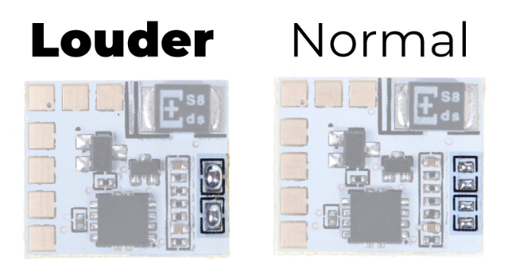

The Following was written by the team at [RetroSix:](https://retrosix.co.uk/)

To begin with it's always best to test your original consoles sound works. It isn't always required, as you have have a dead speaker, but if your console works first its a good sign. 

Open up the Game Boy Color using a Tri-wing screwdriver by removing the 6 screws on the back (2 inside the battery compartment).

Once inside, it is easier to also remove the main circuit board from the shell by removing the 3 Phillips screws from the bottom half. Before lifting out the console, push the black tabs on either side of the ribbon connector at the top towards the top of the shell. This releases the pressure on the ribbon cable and you can pull out the cable, leaving the screen stuck down in the front shell. Now remove the circuit board from the shell.

Remove the old speaker from the front PCB by cutting or desoldering the speaker wires.

Use double sided tape (optional) to secure the CleanAmp onto the back side of the speaker, as shown. 

Take some Kynar/wrapping wire (30awg or 28awg gauge wire - the thin stuff), cut it to length and solder the wires from the points on the Game Boy Color to the pads on the CleanAmp as shown.

Be careful when soldering the CleanAmp pads that you do not short the pads together or remove the resistors or capacitors near the pads.

Solder the two top right wires on of the CleanAmp to the speaker. Polarity doesn't matter, you can solder either wire to either side.

### Increase Amp Volume

If you want the audio even louder you can join these two pads together. If you don't like it, just remove the solder joins to restore it to normal.

### Troubleshooting

The bottom right wire is ground, going to the bottom left pin of the regulator on the right of the console.

The wire to the left of that is the audio input. This is the unamplified, volume controlled sound from the console. This is connected to the middle pin of the volume wheel.

The wire to the left of that is power in from the Game Boy Color. It is the top left pin on the regulator on the right of the console. This should be 5 volts.

The second wire up on the bottom right is the headphone pin that should be grounded when no headphones are present and floating when headphones are inserted. It is connected to pin 5 of the headphone connector. If you have no audio the first check is to solder the wire to the same pad as the ground wire. If that makes the audio work, but when its connected to the correct location it doesn't, you have a damaged headphone jack. You can leave the wire where the ground wire is soldered, but your speaker won't turn off if you insert headphones.

NOTE: It is highly recommended to installer the power capacitor for the GBC to remove the audio noise from the speaker and prevent reboots during high volume.

If your regulator is weakening, it is also recommended to upgrade to a CleanPower board to allow extra power for mods such as new screens and amps on the 5V output.

