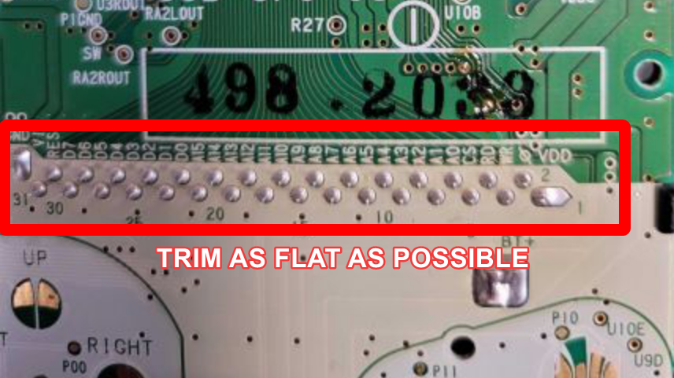
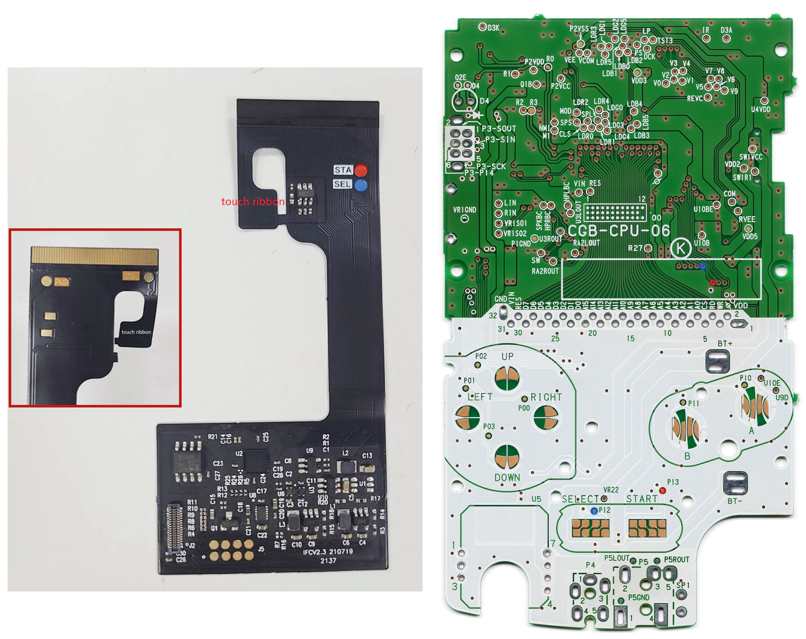

# Video

<https://youtu.be/0z3mswDC598>

## WARNINGS

*   [Test the kit before installation!](https://www.youtube.com/watch?v=K6dhyXIUBT4) Once the display is mounted it cannot always be safely removed. We ask that you test the kit by hooking it up before removing the screen protector and before fully mounting the display.

*
    LCD may break if put under too much pressure or dropped. Please exercise extreme caution when installing.

*   Damage to console or LCD may occur if you do not trim the cartridge port pins. Exercise caution when trimming pins, wear eye protection to protect from pin debris when cutting the metal. Damage caused by these pins are not covered under our return or exchange policy. Trim the pins of your Gameboy's cartridge slot flat so that they don't interfere with any parts of the kit. We also recommend placing some Kapton tape over the trimmed pins to prevent any shorts.

**We highly recommend purchasing **[**the pre-cut shells from FunnyPlaying**](https://handheldlegend.com/collections/game-boy-color-gbc-shells/products/funnyplaying-game-boy-color-retro-pixel-ips-shell?variant=39833187975302)** to avoid pressure issues caused by trimming the shell yourself. As **[**per our policy**](https://handheldlegend.com/policies/refund-policy)**, once an LCD kit has been installed, it no longer qualifies for replacements.**

# Install Guide

:::hint{type="info"}
Ensure your kit has all the included parts, this kit includes:&#x20;

*   1x Enlarged IPS LCD with laminated lens already adhered

*   1x Flex PCB cable

*   3x Wires for power and function adjustments

*   1x 3M Adhesive
:::

Starting the install guide, we recommend disconnecting the ribbon cable from the screen in order to prepare it for soldering.&#x20;

We will start with tinning the pads and soldering the wires in place. The kit includes two longer wires and one shorter wire, we recommend using the shorter wire for the power point and the longer two for the buttons.&#x20;

Once we have all three wires soldered, we can insert the screen into the shell after removing the paper form the adhesive on the back. The bottom half of the screen will slide into the shell first, then the entire display will hinge into place.&#x20;

Up next we can reconnect the control board back to the screen, we recommend putting the protective sticker on the back of the display before connecting the PCB.&#x20;

Now we can put all the buttons and their membranes into the shell.&#x20;

Now comes in the motherboard for soldering, you can use either the vias located near the top of the motherboard, or you can use the test pads located right next to the start and select buttons.&#x20;

Simply solder the longer wire to the corresponding points on the motherboard, either next to the buttons or above the cartridge slot pins.&#x20;

Finally you can connect the ribbon cable and solder your power wire to the point labeled "C" on the power switch.&#x20;

We had to add on a second touch sensor in order to read the touches through the shell, if you experience anything like this you can use copper tape and any wire to make your own touch sensors.&#x20;

## Functions:

*   Hold down START and SELECT together for a few seconds, the "GAME" on the lens should be the only word lit up. This is "Mode 1."  Here you can use the SELECT and START button to move the display image down and up respectively.&#x20;

*
    Holding a press on the touch sensor for a few seconds, will bring it to "Mode 2." You should see "Boy" lit up now. Here You can use SELECT and START to move the display image left and right respectively

*

    Holding a press on the touch sensor again for a few seconds, will bring it "Mode 3." You should see "Color" lit up. Use START and SELECT separately to cycle through the different color options.&#x20;



*   Hold down START and SELECT together again for a few seconds to confirm, and exit. &#x20;



*   To cycle the different Pixel modes, tap and hold where the touch sensor is for a few seconds, and the LCD will change to different screen modes each time you perform this.&#x20;

## Pixel Modes:

*   Built-in 5 display effects.

*
    Full pixel copy display (display the highest brightness, gorgeous and concise)

*   Classic GBC display (perfectly restore the original display effect)

*   Classic RGB display (perfectly restore the original display effect, and the pixel gap looks smaller, the brightness will be slightly darker)

*   RGB display (closest to the original display, but the brightness is very low)

*   Grid line display (close to the display effect of DMG)

## Troubleshooting:

[IPS Troubleshoot Guide.](https://wiki.handheldlegend.com/ips-troubleshooting-guide)

Is the logo on your laminated lens not illuminating properly? Try these steps to resolve it.

1.


    Hold down the touch sensor longer than you would for any of the effects. Basically just an extra long press (at least 10 seconds) until the issue disappears.&#x20;

2.  Hold down start and select for a long press (at least 10 seconds) as well. This is supposed to factory reset the lens.

If the issue does not get resolved with one of these methods or you have any other questions, please reachout to support at support\@handheldlegend.com

