:::hint{type="info"}
**This guide was last updated June 23, 2022 to make it more clear that the BAT wire is required for operation of this kit.

For dry testing, soldering the BAT wire will not void the warranty.**
:::

This is our guide on installing the Game Boy Color HDMI-Enabled IPS kit. This kit features a mini-HDMI port and is an advanced install process. The output is a clean, crisp pixel-perfect image! *Options are included to scale the picture to full screen or use the original aspect ratio (default setting).*

:::hint{type="info"}
Hand Held Legend earns commissions for Amazon purchases made through links in this post.
:::

## Getting Started

### SAFETY NOTICE

:::hint{type="danger"}
**PLEASE READ BEFORE PROCEEDING!**

**
\-Respirator Required-**
This mod requires filing which may cause plastic dust to become airborne. This is dangerous to inhale. Use a mask or respirator when performing the required filing step.

**-Gloves Required-
**This mod may require trimming with a razor blade. If you do not know what you are doing, you can seriously injure yourself resulting in a trip to the ER. Please wear gloves and exercise extreme caution when working with craft blades/razors.
:::

### Required Tools/Parts

:::hint{type="warning"}
In this guide, we are using a RetroSix Prestige shell for installation. You may use another pre-cut shell for this install, just note that there may be differences compared to what you see in this guide!
:::

*   Precut IPS-ready shell **(Will require extra trimming for logo illumination!)**

*   Tweezers

*   Plastic Spudger tool

*   Soldering Iron and supplies ([See our soldering guide first if you're new to this!](https://wiki.handheldlegend.com/soldering-iron-guide))

*   [Diamond file and flush cutters](https://www.amazon.com/dp/B07TSK23LY?tag=hanhelleg-20)

*   [Razor blade or craft blade](https://www.amazon.com/dp/B07YYWF2WG?tag=hanhelleg-20)

*   [Work gloves](https://www.amazon.com/dp/B074XCXVCM?tag=hanhelleg-20)

*   [Mask for plastic dust](https://www.amazon.com/dp/B085B8Y9XH?tag=hanhelleg-20)

### Optional Recommended Tools/Parts

*   [Color-coded wire](https://www.amazon.com/dp/B07BLZ333V?tag=hanhelleg-20)

*   [Kapton tape](https://www.amazon.com/dp/B07F8TZZ4N?tag=hanhelleg-20)

*   [Calipers](https://www.amazon.com/dp/B08Y8M54M9?tag=hanhelleg-20)

*   [Compressed air](https://www.amazon.com/dp/B099764RQN?tag=hanhelleg-20)

### Take Inventory

Your kit should include these parts.

*   Mini HDMI to HDMI adapter

*   Red wires for soldering

*   IPS panel

*   IPS control PCB (green colored)

*   Screen lens with logo cutout

*   Insulating film (2x)

*   IPS screen adhesive

*   IPS display ribbon cable

### Prerequisite Tips and Steps

:::hint{type="warning"}
Installing your IPS kit, bending the ribbon cables, soldering, or applying any adhesives in this kit will **void the warranty and return policy.** [Fully test your kit before proceeding.](https://wiki.handheldlegend.com/ips-lcd-dry-test)
:::

*   Test your IPS kit to ensure it's functioning properly before the install. Soldering the BAT wire per the instructions in this guide is required to test the kit and will *not void the warranty*.

*   Fully disassemble your Game Boy Color before starting this guide.

*   Get familiar and comfortable with soldering before attempting this mod.

*   Consider purchasing two shells or using your original shell for filing practice. The filing step is very difficult for new modders.

*   Take your time, and read through the entire guide before starting the install.

### WARNINGS

*
    LCD may break if put under too much pressure or dropped. Please exercise extreme caution when installing.

*   Damage to console or LCD may occur if you do not trim the cartridge port pins. Exercise caution when trimming pins, wear eye protection to protect from pin debris when cutting the metal. Damage caused by these pins are not covered under our return or exchange policy. Trim the pins of your Gameboy's cartridge slot flat so that they don't interfere with any parts of the kit. We also recommend placing some Kapton tape over the trimmed pins to prevent any shorts.

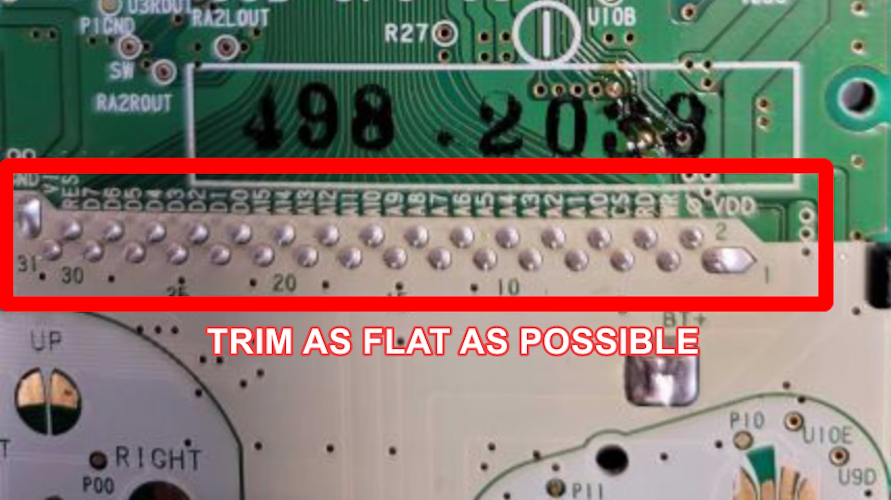

## Install Guide

### Trimming The* *Shell

On the RetroSix Prestige shell, trimming is made easy with a few small plastic posts that need to be snipped off in the following locations.

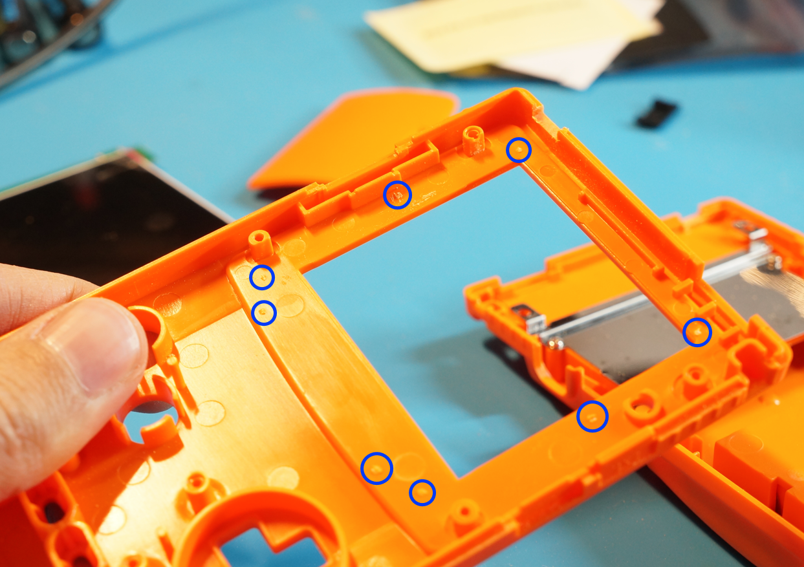

The lower screen portion should be trimmed off using flush cutters if you would like to utilize the illuminated logo feature. **This step is completely optional!**

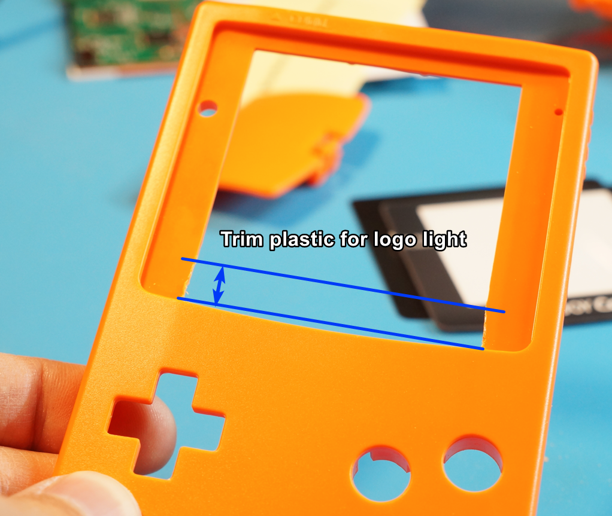

### Filing the HDMI Port Slot

Both halves of the shell will need to be filed to fit the HDMI port properly.

First, place the IPS control PCB into the front shell as shown. We are going to use a razor blade to mark where we are going to file into the plastic.

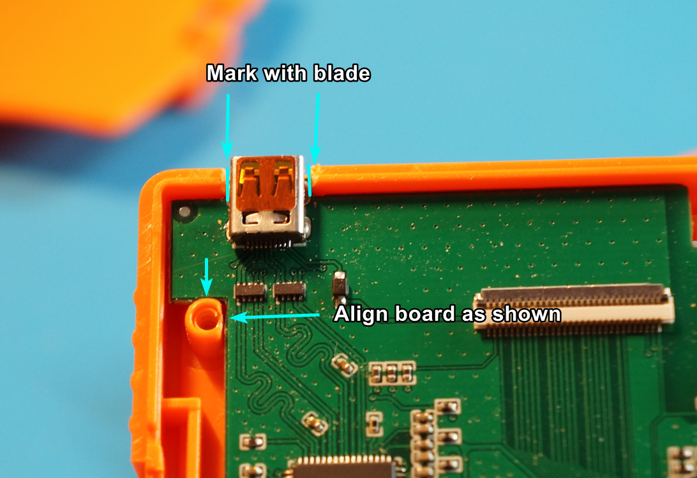

:::hint{type="danger"}
Take your time when filing! You can always remove material, but you cannot add more. Make small adjustments and check the fit every 30-60 seconds of filing.
:::

The slot should be about 7.75mm in width and 3mm in depth. Calipers are helpful here to confirm the measurement.

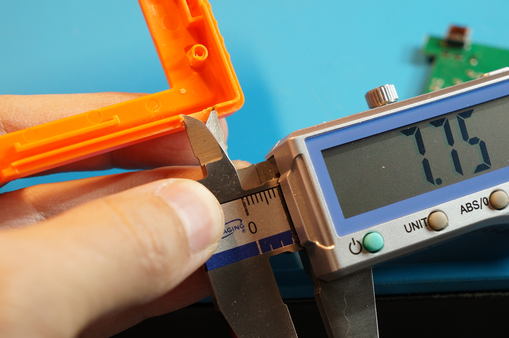

Perform regular test fits to ensure your result looks something like this.

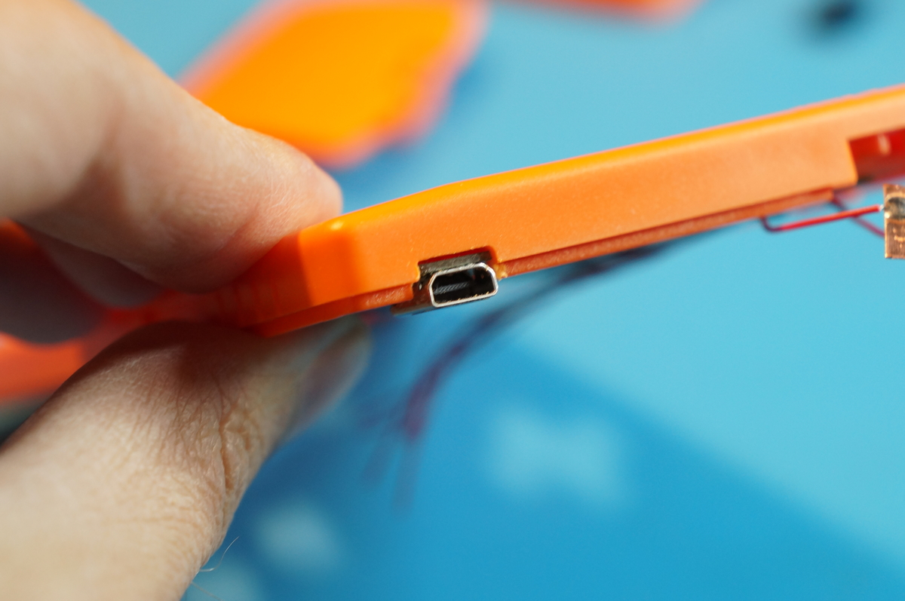

Once you get to this stage, place the rear shell against the console and use your blade to mark the other half of the shell as a guide for filing.

File away the material and regularly test the fit until your shell looks something like this. The fit should be snug but not too tight.

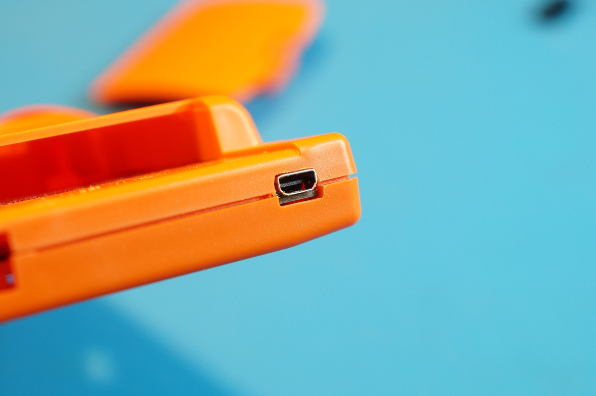

### IPS Display Install

Install the included screen adhesive to the front shell.

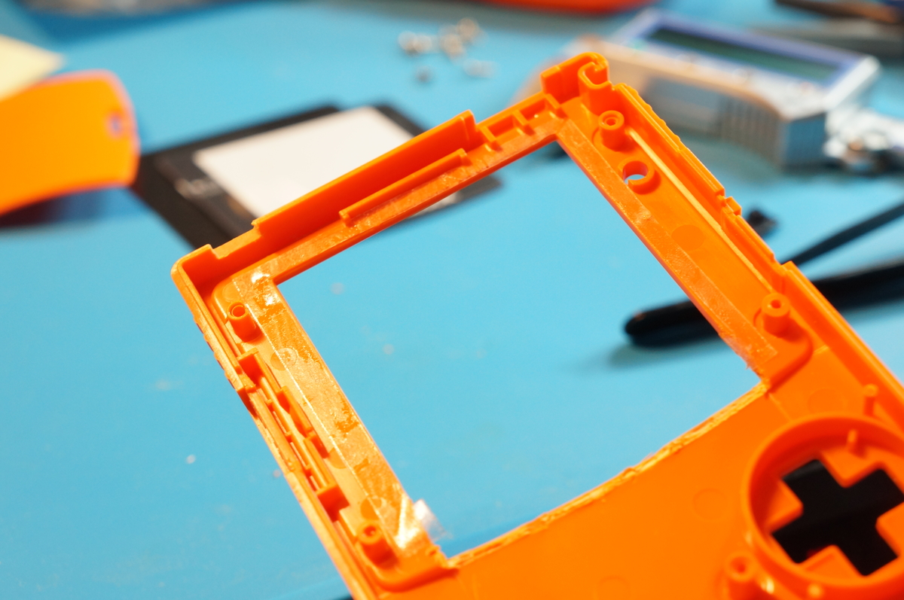

Peel the protective layer on the IPS panel. Place the IPS panel into the front shell.

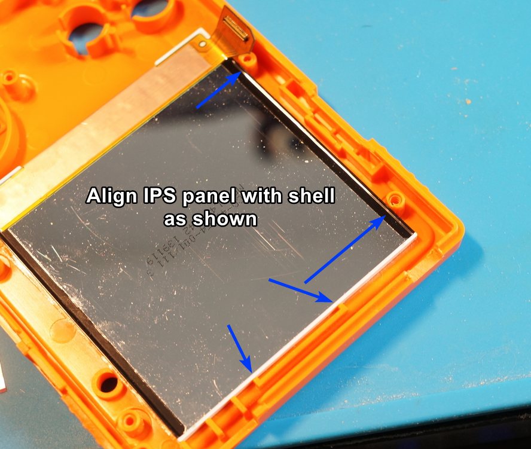

Use some compressed air or lint-free wipes to ensure the front of the screen is dust free. Peel the adhesive off of the included glass lens and install it to the shell. The logo will look black if you performed the trimming step for the illuminated logo.

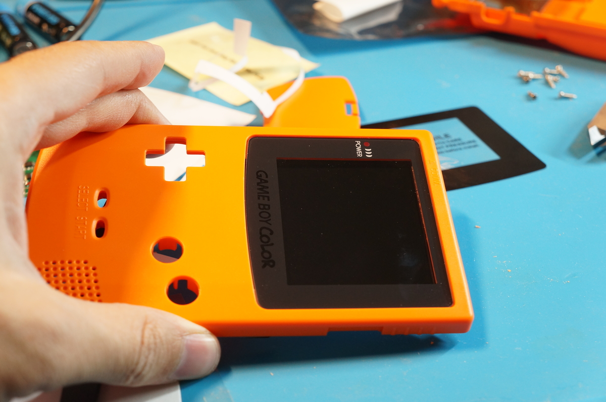

### Soldering Wires

For this step, we recommend color coded wires. There are a lot of them, and it can be easy to mix these up. See the supplies list at the top of this guide for the wires we used in this step.

:::hint{type="info"}
You must solder the BAT wire for this to function properly. This board pulls power directly from the batteries.
:::

Solder the wires to the following connections

*   A - A button

*   B - B button

*   SEL - Select button

*   BAT - Battery voltage and board power

*   G - Ground

*   R - Right channel audio

*   L - Left channel audio

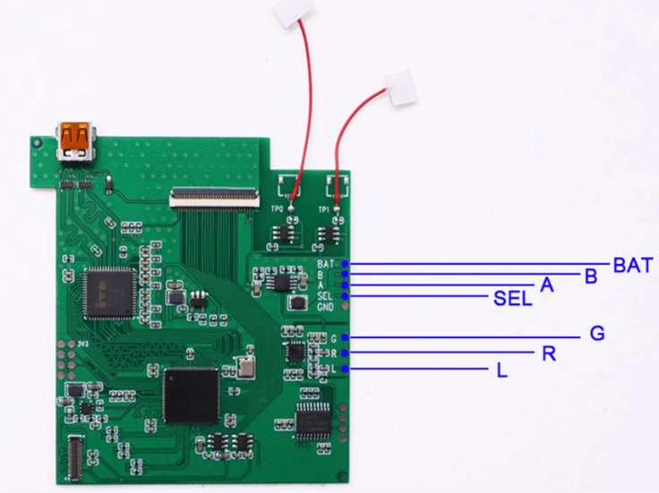

Highly recommended - isolate the connections with a strip of kapton tape.

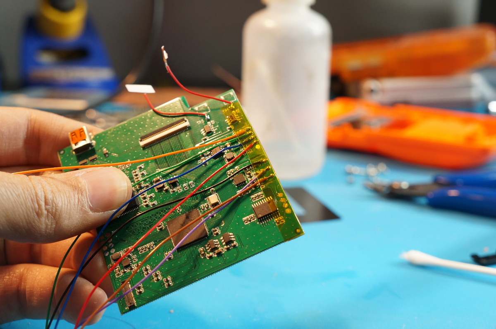

Install the IPS Control PCB into the front shell on top of the IPS panel. Connect the small display FPC connector. Take your time and extra care during this step as you may damage the connector. The connector snaps in like a building block.&#x20;

We recommend adhering the touch sensors to the top of the front shell. These can then be adjusted by tapping the top of your console. One touch sensor is for brightness, the other is for color mode. If you do not want to use the touch sensors, we recommend adjusting the settings to your liking during a [dry test](https://wiki.handheldlegend.com/ips-lcd-dry-test). Power off the console, then trim the touch sensors to ensure the settings do not change.

### Connect to Main Board

Place the front shell next to the main console PCB as shown. This will facilitate easier install of the wires and leave you with a much cleaner end result. Install the display ribbon cable dark side up. You do not need to connect it to the main board at this stage.

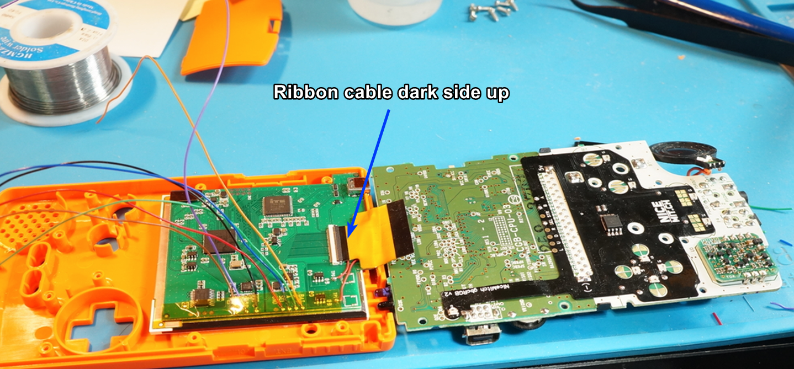

See the soldering guide indicating the connection points for the wires leading from the IPS control PCB. If you're using our [RetroGlow LED kit](https://handheldlegend.com/products/game-boy-color-rgb-led-button-kit?_pos=2&_sid=1a0546ad3&_ss=r), several of these solder points are relocated to a much more convenient location as demonstrated in this install.

:::hint{type="info"}
We are aware that the manufacturer recommends soldering the audio wires to 'LIN' and 'RIN' respectively. ***This step is incorrect*** and we present to you the proper solution. **R** goes to **VR1S01** and** L** goes to **VR1S02** on the main board. This allows the HDMI audio to function irrespective of the volume wheel position.
:::

Here's our end result. We trimmed the wires to length and soldered them. You may also hold the wires down in place with kapton tape to make reassembly a breeze!

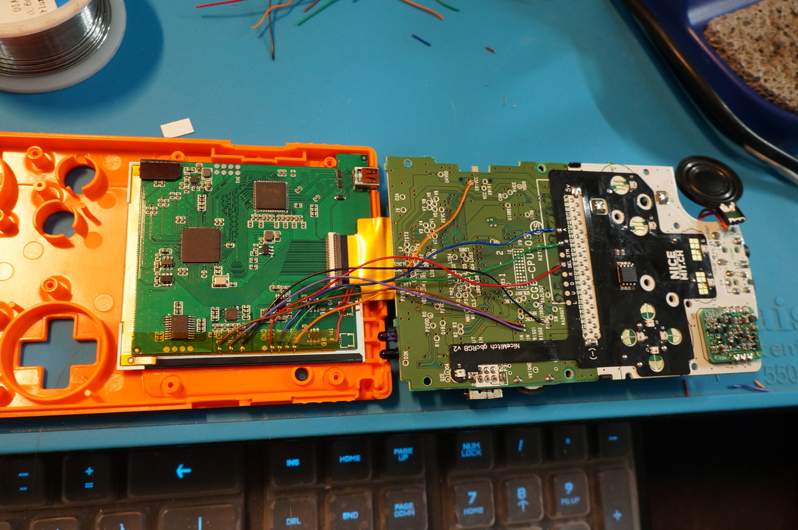

Apply kapton tape over any exposed connections. Apply the included PCB isolation film optionally, though we find the adhesive on those films to be quite weak and you may have difficulty ensuring it stays in place.

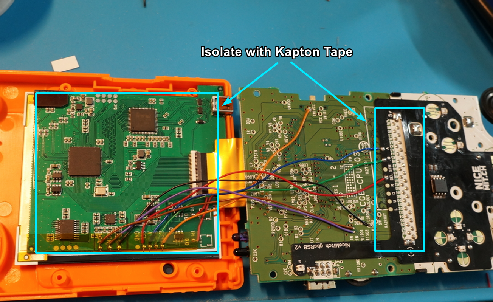

### Reassemble and Test

Fully reassemble your Game Boy Color taking care to ensure no wires get pinched during the process. With the wires cut to length, the entire assembly can fold closed like a book. We recommend using the original screws if possible.

## Using the OSD

To access the OSD menu, press A+B+Select. From here, see the controls guide below.

*   To enter/select a menu, press *select+A.*

*   To exit/leave a menu, press *select+B.*

*   To change an option, press *A or B.*

The OSD menu options change depending on whether or not you are in HDMI mode. HDMI mode offers a unique option to adjust the screen mode. You can do 1:1, full screen, or expanded full screen. The touch sensor for color mode works normally in this mode. The brightness touch sensor does not do anything with HDMI plugged in.

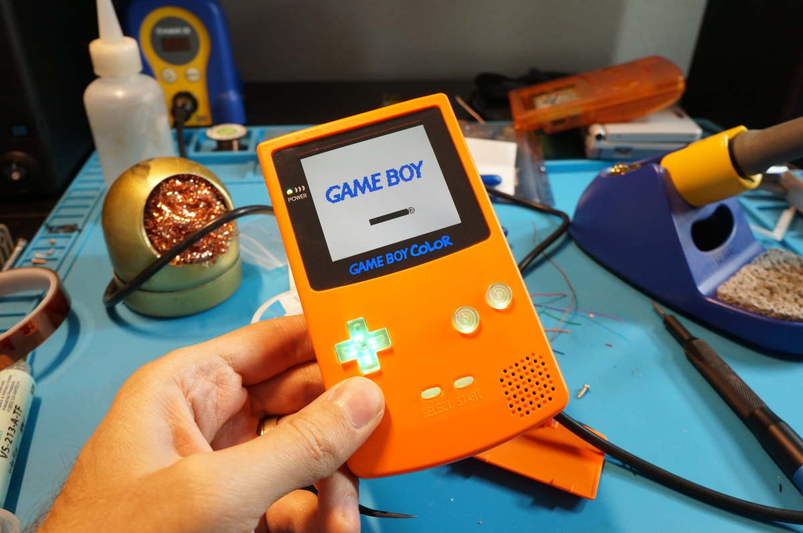

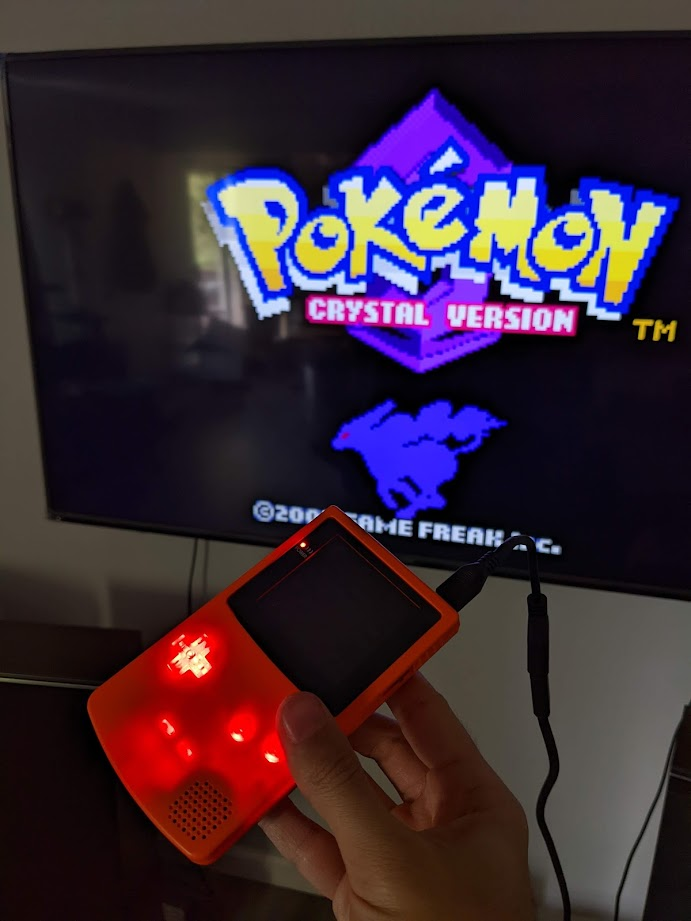

## TROUBLESHOOTING

*   [IPS Troubleshoot Guide.](https://wiki.handheldlegend.com/ips-troubleshooting-guide)

*   If you have any questions or concerns, please reach out to support\@handheldlegend.com

