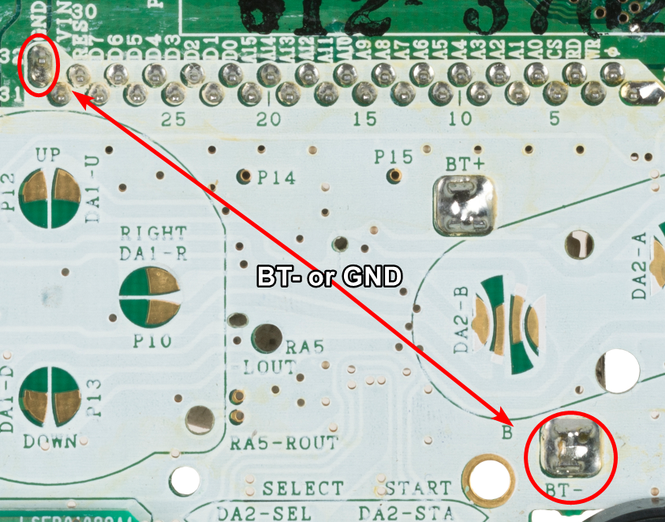
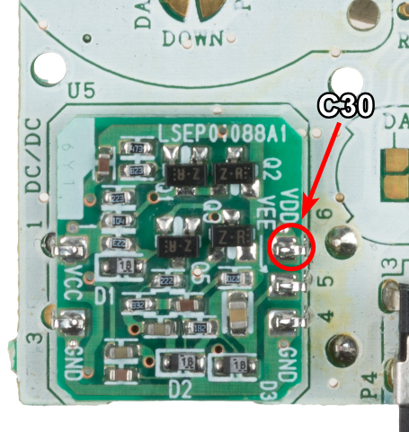
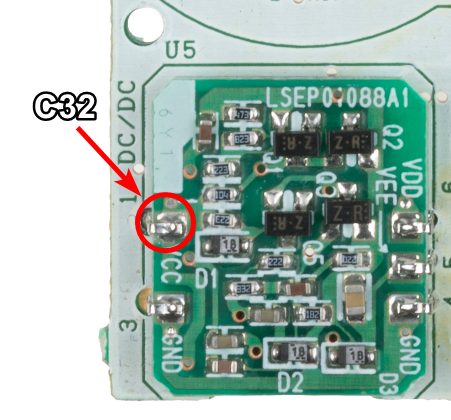
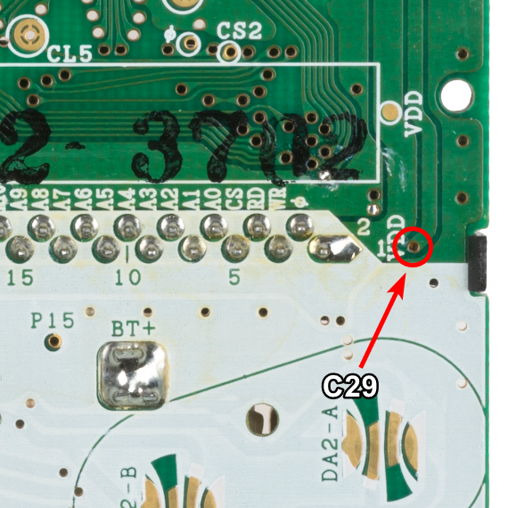
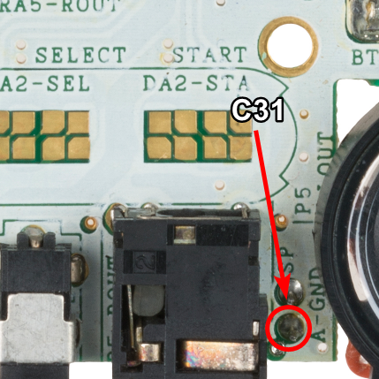

If you're unsure about whether your Game Boy Pocket console needs a recap, you can test the voltage at these points associated with each electrolytic capacitor.

Unless you have a power supply, measuring the capacitors can be a difficult task unless you know exactly where to probe. We've laid out these locations below so you can test the voltages with AA batteries in the Game Boy Color housing (Which blocks the rear side of the PCB).

Measurements are performed with a multimeter in DC voltage mode. Read your multimeter's manual for full details on setup for your device.

Your black probe can be placed on the negative battery terminal labelled **BT-** on the PCB. Your red probe would go to the point for which you are measuring voltage. An alternate location for the black probe is also shown here.

If your readout is significantly less than the voltages listed, the respective capacitor likely needs replacing.

## Measurement Locations

### C30

### C32

### C29

### C31

:::hint{type="danger"}
If you do not get a voltage read out, you may also have a dead speaker. Test the speaker as well to be sure.
:::

## Capacitor Measurements

The following measurements were performed on a known working board that has been recapped.

| Cap Name | Voltage |
| -------- | ------- |
| C30      | 5v      |
| C32      | 2.93v   |
| C29      | -18v    |
| C31      | 1.25v   |

## Citations

Board scans originated at <https://commons.wikimedia.org/wiki/File:Nintendo-Game-Boy-Pocket-Motherboard-Top.jpg> - Evan-Amos, Public domain, via Wikimedia Commons

