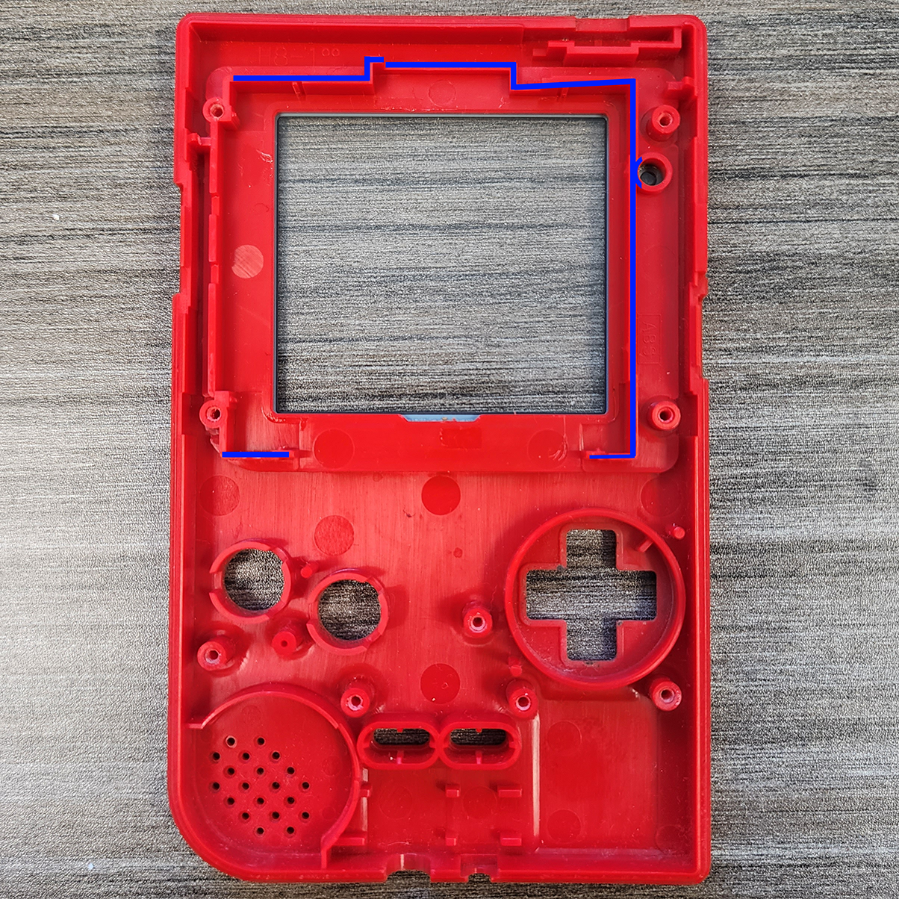

This is our install guide for the [GAME BOY POCKET IPS LCD KIT - FUNNYPLAYING](https://handheldlegend.com/products/game-boy-pocket-ips-lcd-backlight)

## Video

<https://www.youtube.com/watch?v=H4bQ6o3Vf50>

## Getting Started

:::hint{type="info"}
This kit requires the soldering of one power wire and an optional touch sensor.&#x20;
:::

Required Tools and Parts

*   Tweezers

*   J1 (Japanese Industrial Standard) Screwdriver

*   Y1 Tri-point screwdriver

Take Inventory

Ensure you have all the parts included with your kit. See below:

:::hint{type="info"}
The Gameboy Pocket IPS LCD Kit Includes:

*   1 x IPS LCD

*   1 x GBP IPS Ribbon Cable

*   1 x 3M adhesive installation foam

*   1 x Touch sensor

*   1 x Wire
:::

## Before You Proceed

1.  Fully disassemble your Gameboy Pocket

2.  Dry test your new IPS screen to check for damage

**Since soldering is required for dry testing this kit, soldering the power wire will not void the return policy.**

## Shell Modifications

If you plan on using this screen in an OEM shell, you will need to trim all the plastic highlighted in blue. Make sure to constantly check the fit of the screen, you don't want to remove too much material.

## Installing The Mod

After you've modified your shell, it's time to begin installing the mod. First thing to do is to place your display and it's ribbon cable into the shell. If you are using the adhessive, now is the time to apply it before placing the screen.&#x20;

Once you have your screen in place, you can begin putting the motherboard of the console back into place.&#x20;

Once you have your motherboard in place, you can connect your ribbon cable, exposing the two pads that you can solder to.

This will expose the two pads that are availble for soldering. The right pad is the power wire and will connect to the first pin from the left of the power switch.&#x20;

From this point you are technically done, you can button your console up and begin playing.

## Optional Soldering

This kit also includes a touch sensor which will just float in the case should you decide to install it.&#x20;

The touch sensor can then be positioned in the case however you like it.

From here you can put your console back together completely!&#x20;

## Functions

This kit features a variety of options that are accessible through the touch pad. You can enable Retropixel mode by holding the touch sensor for roughly 5 seconds. You can also swap color palletes with a single touch, and go back a color pallete with a slightly longer touch.&#x20;

## Troubleshooting

*   [IPS Troubleshoot Guide.](https://wiki.handheldlegend.com/ips-troubleshooting-guide)

*   If you have any questions or concerns, please reach out to support\@handheldlegend.com

