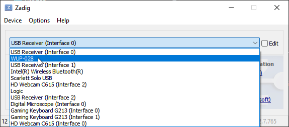

This software can be used to help detect any issues with your ProGCC software, as well as help calibrate snapback with a visual graph!

## Download Links

*   [ProGCC Calibration Software (Windows Only)](https://drive.google.com/open?id=19gn72kqizxU8TnDX1IAuNKBtBdOwcsA7\&authuser=mitch.cairns%40handheldlegend.com\&usp=drive_fs)

*   [Download Zadig](https://zadig.akeo.ie/)

## Prerequisites

When you first use this software, your PC may not detect your controller adapter. You can solve this issue by running Zadig as shown below:&#x20;

### Zadig Set Up

When you first open zadig, you will see this window:

First go up to options at the top and select "List All Devices"

That will populate this list of devices, here you can select your adapter

:::hint{type="info"}
Depending on the adapter you are using, you may see **'GameCube for Switch'** or **'WUP-028'**
:::

Once you've selected your adapter, select WinUSB from the drop down menu

Click "Install Driver". If you see "Replace Driver", the driver is already installed.

Once you have installed the WinUSB driver with Zadig, launch the JoyTool program. **You will need to unzip the software before you can run it!**

## How To Use HHL JoyTool

When you initially open the software you will be presented with this screen&#x20;

From here you can click "Refresh List" at the top to populate your controller selection.

Note: If you are using the GameCube Adapter that we [sell on our website](https://handheldlegend.com/products/gamecube-controller-adapter-for-nintendo-switch), the port numbers are backwards. (Port 1 is 4, port 4 is 1, etc.)

Click the port you would like to connect to. Select 'Connect'.

### Button Test

This will allow you to test the face buttons of your controller to ensure they are all working!  The circle next to each button will be filled when it is pressed! This is a work in progress and not all buttons are yet available on this menu.

### Stick Visualizer

Finally we have the Stick Visualizer tab, this tab shows the inputs from your sticks as you move them around.&#x20;

The software initially defaults to displaying the left stick's X axis value, this can be changed at the top of the screen by selecting which axis you would like to display. You can also toggle back and forth between the left and right joystick.

The purple lines indicate the threshold for input in Smash Bros. IE, if you flick your stick and it rebounds going over that purple line, you will experience movement in game. **This can be calibrated with the snapback adjustment on the controller. **

We recommend moving one level of adjustment at a time until those spikes no longer go above or below the purple line, depending which way you are flicking the stick. To adjust the snapback of the ProGCC all you have to do is:&#x20;

*   Hold Minus and press L/R to decrease/increase snapback filter on X axis.

*   Hold Minus and press ZL/ZR to decrease/increase snapback filter on Y axis.

There is a total of 16 levels of snapback adjustment, the default is zero, so should your stick start to feel sluggish or slow, try lowering the snapback amount.&#x20;

