Many power issues on retro handheld consoles can be resolved with a thorough cleaning of the power switch. This is a detailed guide that will show you how to clean your power switch.

:::hint{type="info"}
Hand Held Legend earns commissions for Amazon purchases made through links in this post
:::

## Common Symptoms

*   Console powers off at the slightest touch of the power switch

*   Console battery indicator light flickers between Green/Red (GBA models)

*   Console screen fades out slowly upon powering off

*   Audible noise when attempting to power on, but failure to show display or sound

## Supplies

### Required Supplies

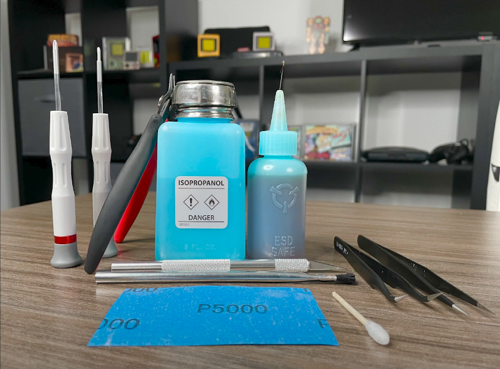

*   Appropriate screwdriver bits for your console (Commonly J0, P0, and Y0, though this may vary).

*   Soldering iron - *Recommended 365c temperature*

*   Isopropyl Alcohol/Isopropanol (99 percent recommended)

*   Razor blade

*   100% Cotton swab (not a plastic handle)

*   Flush cutters

*   Tweezers

### Recommended Supplies

*   [Soldering flux](https://www.amazon.com/dp/B09NXBZBFT?tag=hanhelleg-20)

*   Leaded solder

*   High grit sandpaper

## Written Guide

Disassemble your console completely before starting this process. If you are performing a switch cleaning for the first time, it's recommended to **fully remove the mainboard** before performing any soldering work.

### Recommended: Apply flux and leaded solder

Leaded solder has a lower melting point than the solder used in production. This will allow desoldering of the power switch cover at a lower temperature than you would normally be required to use.

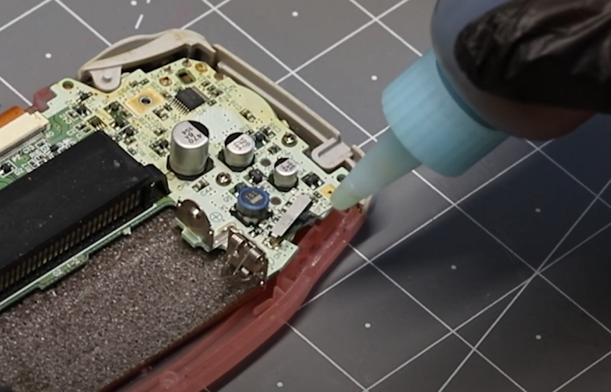

### Insert blade

Carefully insert your blade into the switch cover. We'll use this to lift the switch in the next step. Applying pressure can damage the board. Be *extra gentle* during this step.

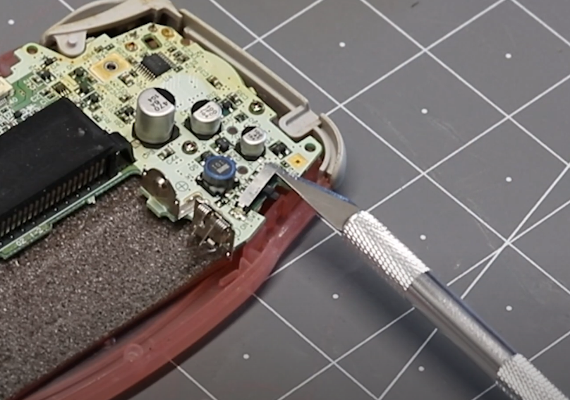

### Desolder and lift

Apply heat with your soldering iron to the side of the switch closest to your blade. Twist the blade once you can see the solder is molten to lift the switch cover.

### Remove the switch cover

Apply heat with your soldering iron to the still-attached portion of the cover. Lift the cover off using your tweezers.

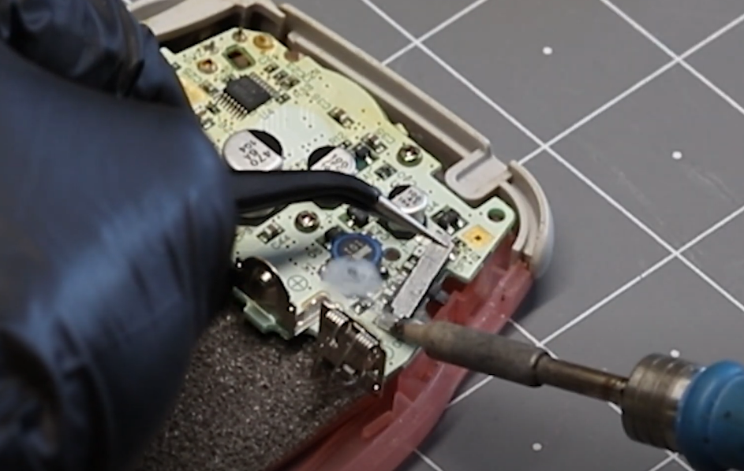

### Scrub with a modified cotton swab

Remove the power switch nub. Place it aside for now.

Use a fresh cotton swab to apply a generous amount of Isopropyl Alcohol to the inner area of the power switch.

Cut the tip off of one end of your cotton swab at a 45-degree angle using your blade or scissors. This will allow you to utilize the compacted portion of the cotton swab. Use the angled tip you've just created to scrub the inside of the power switch until you are satisfied with the results.

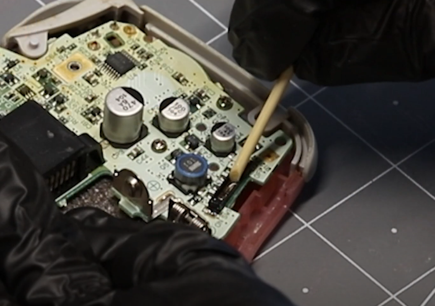

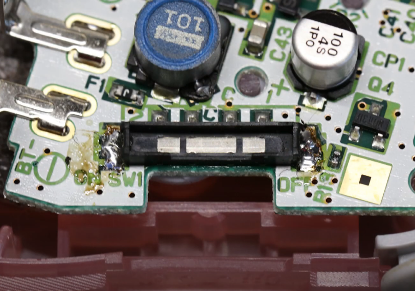

### Optional: Sand or scrape switch contacts

If the inside of your switch is especially oxidized, you may cut a thin strip of sandpaper to sand the inside of the switch. This is an advanced step and should only be used in circumstances where the cotton swab will not remove visible corrosion or oxidization.&#x20;

You might try using the tip of your modified cotton swab to press the strip of sandpaper into the switch.

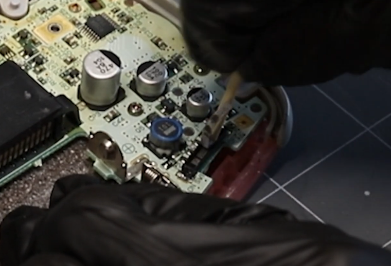

*If you do not have sandpaper handy*, you may try gently scraping any corrosion with the tip of your tweezers.

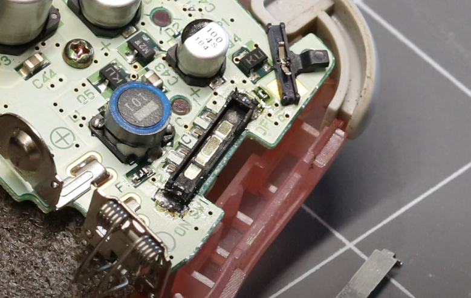

### Clean power switch legs

Before we reassemble the power switch, it is recommended to use a brush with IPA to clean the underside of the power switch with the two metal legs sticking up.&#x20;

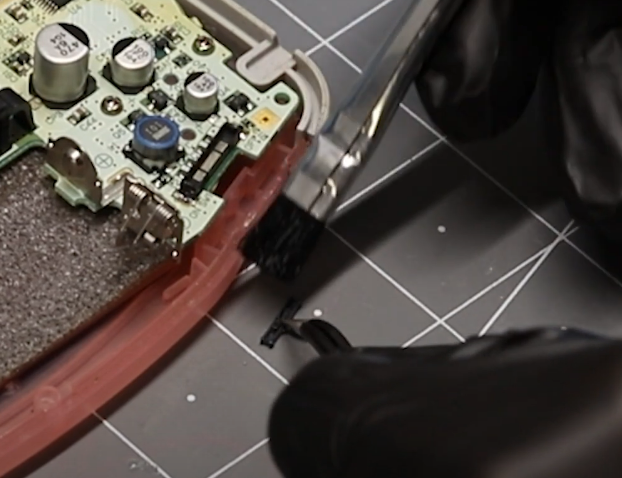

If the switch is particularly oxidized, you may need to hold the center of the metal piece in place while using your blade to scrape the tips of the switch where it will contact the metal pads.

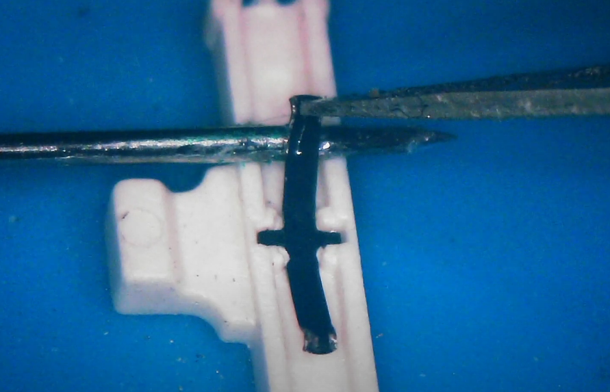

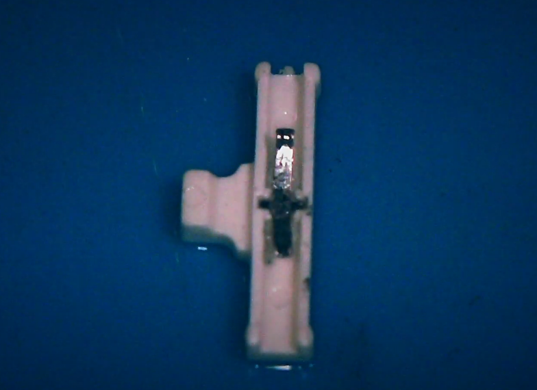

### Reassemble

Replace the switch into the switch housing. Place the switch cover back on top of the cover. Solder each sidewhile pressing on the cover with your tweezers. Take your time to ensure a good fit.

## Video Guide

<https://www.youtube.com/watch?v=w7RqCBF_PTs>

