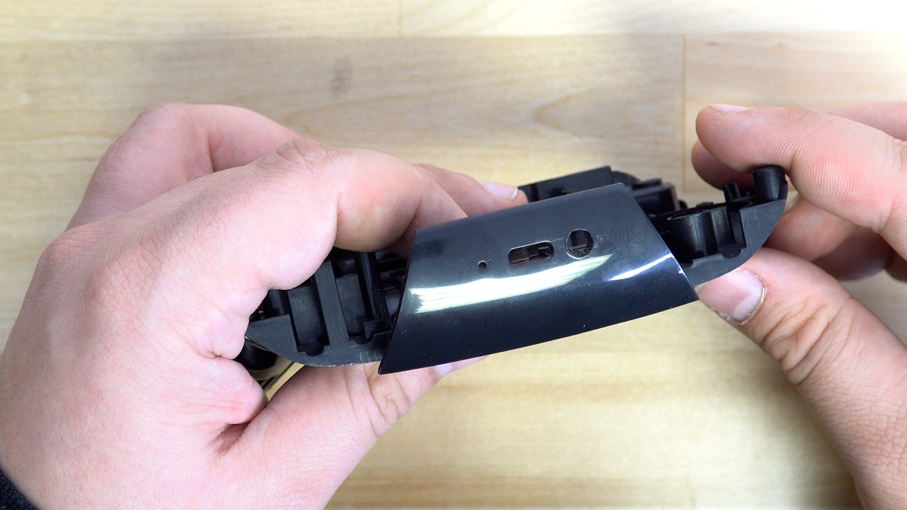
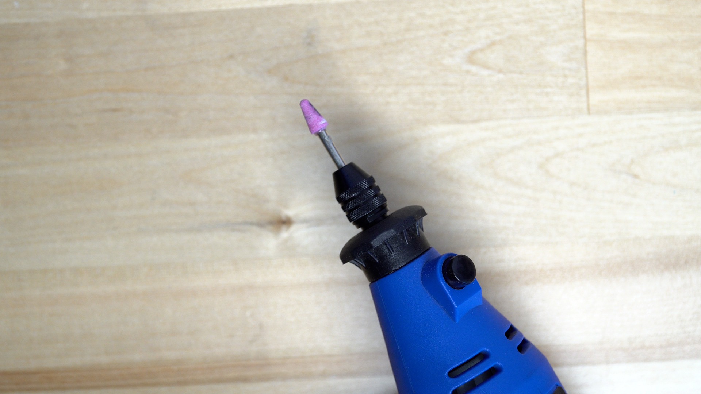
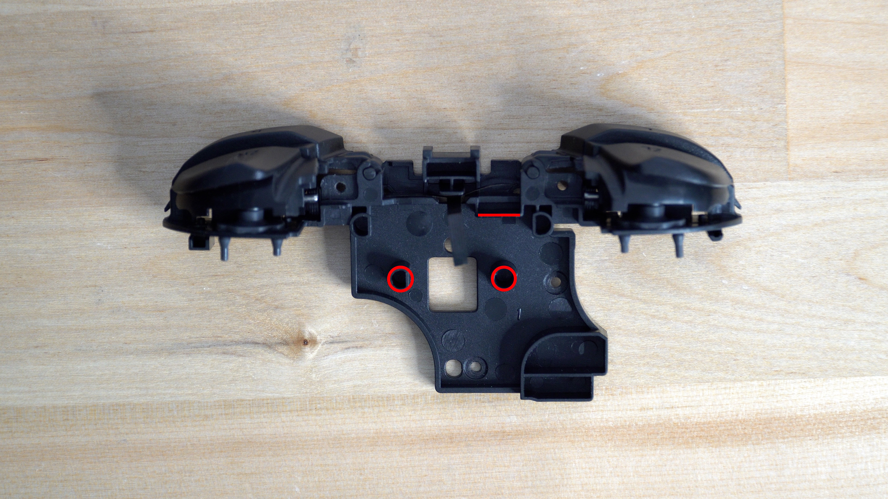
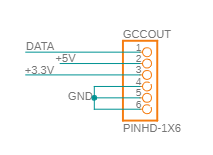
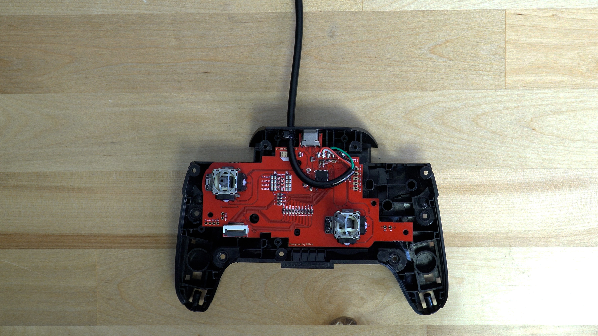

## Video Guide&#x20;

<https://youtu.be/PQ9TYti2m3k>

## Written Instructions

Hardwiring your ProGCC controller is an easy mod to do! First you'll want to disassemble your controller down to the two halves and then take off the plastic that holds the triggers as well.&#x20;

### Shell Modifications

The first decision you have to make is wether you would like to run the cable through the original USB-C port after using hot air to remove the port, or if you would like to use the sync button location. We decided to use the sync button for our install.&#x20;

We expanded the hole using a rotary tool with a cone shaped tip on it

That is followed up by clearing room inside the controller for the cable to sit, so we removed the two posts from the trigger piece. We also removed the wall of plastic that sits right behind the sync button. To do this, we simple used flush cut plyers.&#x20;

You may have to trim more plastic depending on the thickness of your cable and which way you decided to route the cable through the controller.&#x20;

### Soldering

The main part of this mod is the soldering to connect the cable to the controller. You'll need to first clip off the USB-C end of the cable and strip back the black protective plastic revealing the wires. If you are using one of the provided cables that came with the ProGCC, then you will have four wires inside the cable.&#x20;

:::hint{type="info"}
Red is Data

White is 5v

Green is 3.3v
Black is ground
:::

You will then need to solder the wires to their designated spots according to the schematic

Going from left to right you solder your Data, 5v, 3.3v, and Ground connections on the header located right next to the USB-C port. We recommend then pulling some wire through, and placing a ziptie right against the shell of the controller. This ensures that if someone or something was to snag the cable, it wouldn't rip the traces off of the controller.&#x20;

From here you can put your controller back together! You will need to pay attention to how much the cable is pinched by the shell, more cuts may need to be made depending on the thickness of your cable.&#x20;

