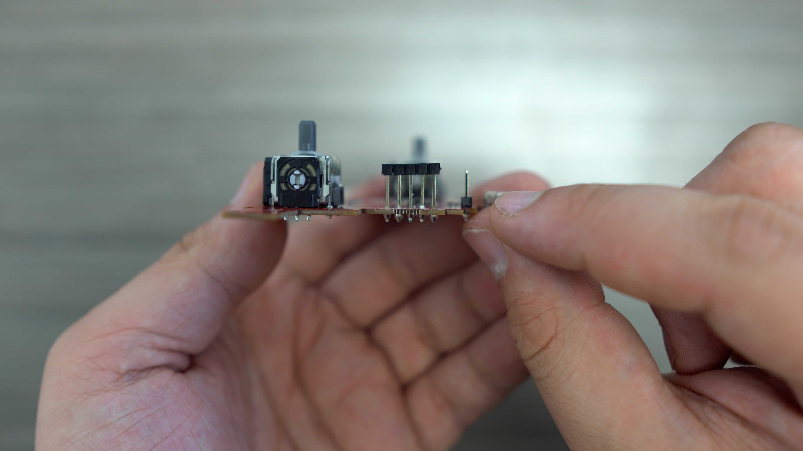
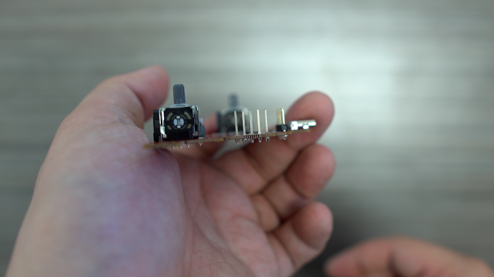
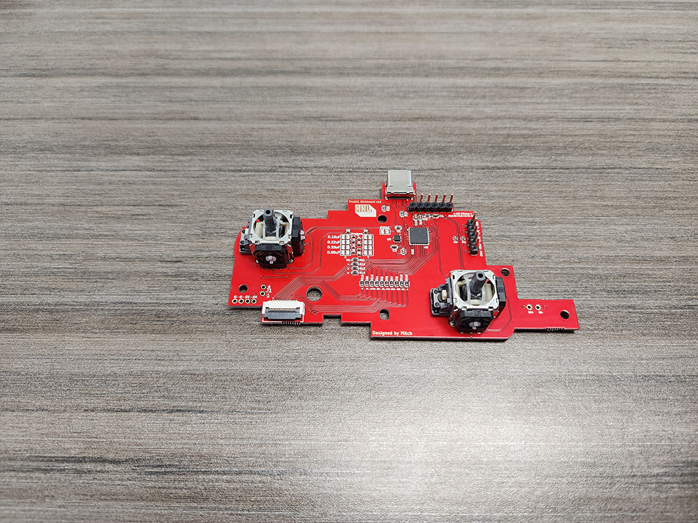
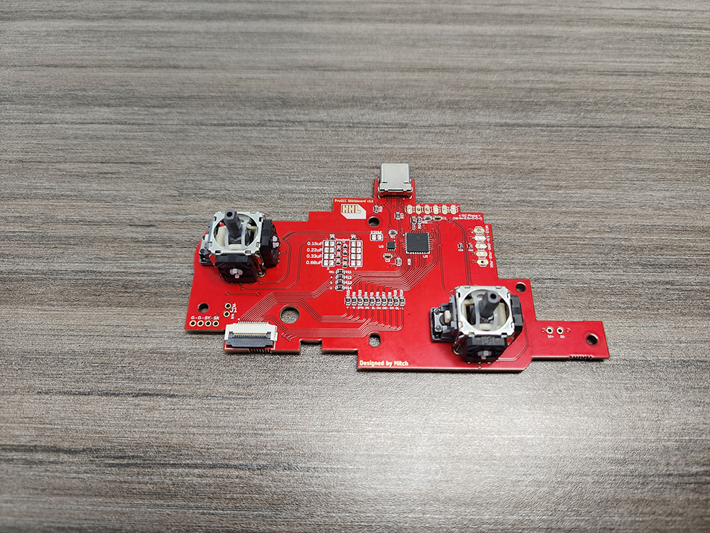
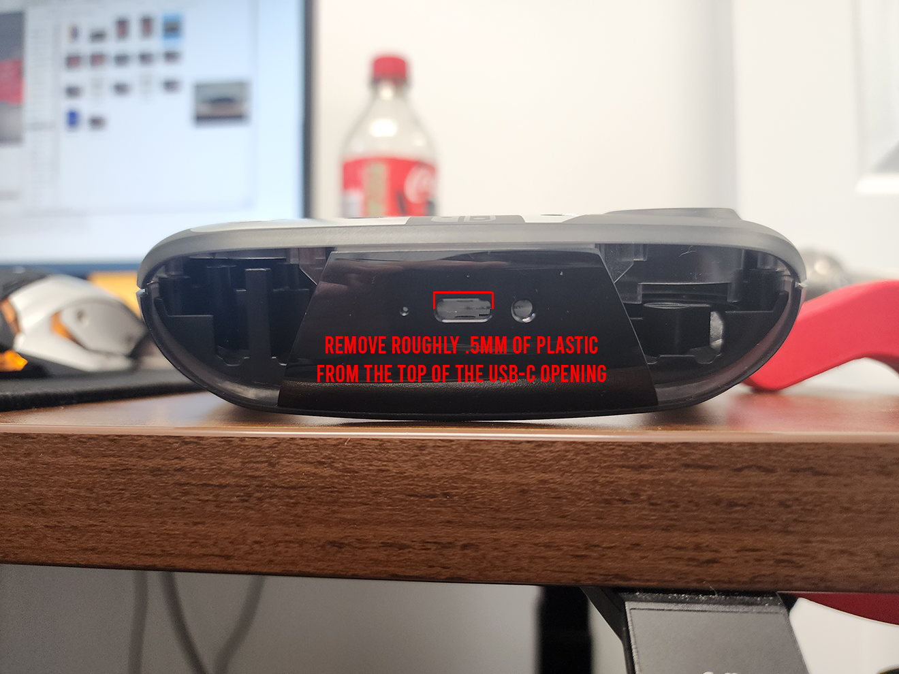

<https://youtu.be/eAKmkea_R9c>

The V2 batch of the ProGCC contains a few errors:&#x20;

1.  The board is too thick (We ordered 1.15mm and got 1.35mm)

2.  The programming headers were soldered onto the board by accident

Solutions:

1.  Shave down the top of the USB-C opening in the midframe of the controller's shell by roughly .5mm

2.  Removing the headers with a soldering iron (Either one by one or the entire piece at once)

# Examples:&#x20;

## Removing Headers

Tip: You can slide the black collar piece of the headers off in order to desolder one header at a time, making the process easier.

Before:

After:

## Modify The Shell

