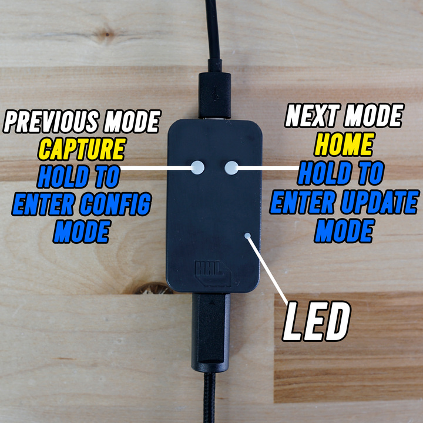

The GC Pocket Adapter By HandHeldLegend is an adapter that will convert both original GameCube and ProGCC controllers to work on Nintendo Switch, Android, Mac, and PC!&#x20;

## Button Diagram

## Basic Operation

Plugging the adapter in to a USB port will power on the adapter. You will see the LED light illuminate as one of four different colors to indicate which mode the adapter is in.

:::hint{type="info"}
GC Pocket Adapter Controller Modes:

DirectInput/Config = Blue  (Windows)
Nintendo Switch = Yellow (Nintendo Switch)
GameCube = Purple (GameCube)
XInput = Green (Windows)
:::

The LED will then either fade to red if there is no GameCube controller unplugged, or it will fade to white if it detects a controller plugged in.

### Performance Mode (1000hz)

Performance mode is disabled by default in GameCube and Nintendo Switch modes. You can enable performance mode by pressing both buttons simultaneously when the controller is unplugged.

The LED will flash green twice to indicate performance mode has been enabled. It will flash pink twice to indicate when performance mode has been disabled.

:::hint{type="danger"}
Performance mode only works on PC. Nintendo Switch will not accept 1000hz input.

If you attempt to plug two adapters in to Nintendo Switch that are operating in performance mode, you will experience disconnecting issues.&#x20;
:::

### Changing Adapter Modes

To change adapter mode, unplug the controller. Press either the left or right button to cycle through the different adapter modes. On each press, you will see the LED light indicate which mode is loaded. The mode is saved and will be remembered if you unplug the adapter from a USB connection.

## Configuration Mode

Hold the 'Previous Mode' or 'Left' button while plugging in the adapter to enable config mode.&#x20;

See our [configurator guide](https://wiki.handheldlegend.com/configurator-guide-gc-pocket-adapter) for full details on the available configuration options.

## Nintendo Switch Operation

Using the GC Pocket Adapter with Nintendo Switch is easy! All you have to do is enter Nintendo Switch mode (Yellow) or GC Mode (Purple) and plug it into the dock in order to use the adapter with your console.

The adapter will turn red to indicate that a controller is not plugged in, when you plug a controller in the led will fade to white to indicate a controller has been plugged in and is recognized by the adapter. Press any button on the controller and it should be recognized by the console.

### Function Buttons

In this mode, the two buttons function as Home/Capture respectively (Yellow mode only).

### Rumble Support

Rumble is only supported using the GameCube Adapter mode (Purple mode).

## Steam Operation (PC and Mac)

To use the GC Pocket Adapter with Steam, enter XInput mode (Green) and connect your controller to the adapter, this will prompt Windows to recognize that an Xbox 360 controller has been plugged in.&#x20;

### Rumble Support

Rumble is supported in XInput mode with compatible games.

## Android Operation

The adapter is compatible with Android in any of the adapter modes. Game compatibility will vary. The GameCube Adapter mode (Purple) is only compatible with a few select applications including Dolphin Emulator.
